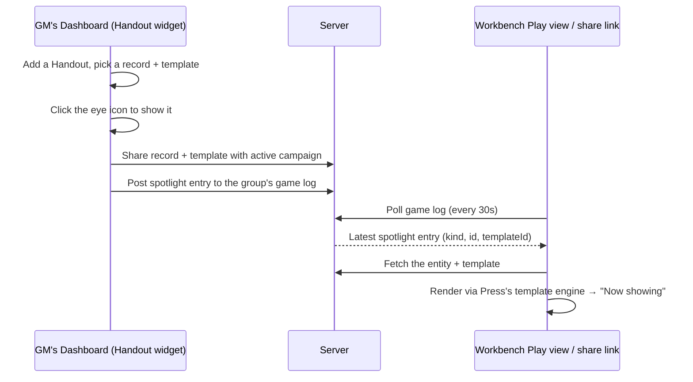

# Undercroft Suite

Undercroft is a suite of TTRPG tools for building content and running sessions —
system-agnostic by default, D&D 5e-flavored out of the box. Each tool is a
useful generator or editor on its own, but they share one account system, one
content library, and one campaign model, so a GM can prep across several tools
and then run an actual session without leaving the suite.

This document covers the whole suite: what each tool does, how content and
accounts work across all of them, how a GM shares prepped content with a table
and shows it live during play, and — in the later sections — the UI, code, and
architecture conventions for anyone working on the codebase itself.

---

## Getting Started

Undercroft is a vanilla JavaScript + Bootstrap (loaded via CDN) front end with
a small Python backend. No build step, no npm, no `package.json`.

1. Clone the repo.
2. Make sure Python 3 is installed.
3. From the repo root, run:
   ```
   python web-server.py
   ```
   (or double-click `web-server.bat` on Windows — it runs the same command).
4. Open `http://127.0.0.1:8000/undercroft/` in a browser.

`web-server.py` reads `server.config.json` (repo root) for its host/port
(defaults to `127.0.0.1:8000`), session length, the SQLite database path
(`data/database.sqlite`, created automatically on first run), and a default
admin account (`admin` / `admin`) seeded for local development. Pass
`--config <path>` to point at a different config file.

---

## The tools

| Tool | Role |
| --- | --- |
| **Orrery** | Map creator and viewer — system-agnostic base maps, layers, grids, groups, and entity-referencing markers. |
| **Press** | Versatile printing utility — turns any saved record into a card, sheet, or booklet via authored templates. |
| **Repository** | Wiki-style campaign journal. |
| **Workbench** | Character sheet and template editor — plus the live Play view a table actually uses during a session (game log, dice rolls, "Now showing" cards). |
| **Crucible** | Monster and adversary creator — Creature Type + Archetype + Role, built from a shared feature graph. |
| **Forge** | Non-Player Character generator — identity, 4D personality axes, optional AI-written character notes. |
| **Sanctum** | Location and dungeon generator — settlements, structures, regions, and everything about them (features, assets, needs, relationships). |
| **Vault** | Spell and magic item generator — a budget-based effect economy built from the same feature graph as Crucible. |
| **Loom** | Manage data or import external content — the generic Library/System editor where every reference-data kind (Systems, Species, Archetypes, Features, Resources, and any creator-defined kind) is authored, and where external content (e.g. D&D Beyond) gets imported via mappings. |

There's no separate "Admin" tool — account tiers, content ownership, sharing,
and Campaign Group management live inside Loom (tier-gated tabs) and the
account page (`common/account.html`), both reachable from the signed-in menu
in every tool's header.

Every tool shares the same header chrome (login, tool switcher, theme toggle,
and — once signed in — the Campaign selector described below), the same
three-pane shell, and the same save/share/print plumbing described next.

---

## Shared architecture

### The Library

Nearly everything any tool produces — a System, a Location, an NPC, a Monster,
an Effect, a Template, a Map — is a **Library item**: one row in a single
database table (`library_items`), addressed by a `kind` (`location`, `npc`,
`monster`, `map`, …) and an `id`. A new kind needs no new server code — dropping
a `undercroft/common/data/kind/<kind>.json` file in (label, icon, and the two
tiers below) is enough for every generic save/list/get/delete/share route to
support it immediately.

### Accounts and tiers

Every account has one tier: **free < player < gm < creator < admin** (no other
tiers exist — check `role_rank()` comparisons, not string equality, anywhere
tier logic is enforced). Each Library kind declares a `readTier` (how high a
tier you need to *see* it) and a `writeTier` (how high a tier you need to
*save* it) — a fresh, unregistered kind defaults to "anyone can read, only an
admin can write." Most generator output (NPCs, Monsters, Effects) is wide
open; authoring-heavy kinds (Locations, Settings, Systems) require `creator`
tier or higher.

An account's session begins with registering or logging in, which issues a
session token the browser holds and sends with subsequent requests; logging
out clears it. Tier changes (promoting a player to `gm`, granting `creator`)
are an admin action, done from Loom's Users tab rather than a public
self-service flow. None of this blocks using the suite at all — see Local-first
saving below.

### Local-first saving

None of the generator tools (Forge, Crucible, Vault, Sanctum, Orrery) require
signing in. An anonymous visitor's saves go to their own browser's local
storage; a signed-in user's saves go to the server as a real, ownable,
shareable record. Signing in later doesn't strand anonymous work — every
tool's save path is "local, unless authenticated," never "local only for
guests."

### Sharing

Every Library kind supports the same sharing model, managed from each tool's
own inspector or from Loom: a record can be made **public** (anyone can read
it), or shared with a specific **user** or a **Campaign Group** (below), each
grant carrying `view` or `edit` permission. A share targeting a group applies
to every current member transparently — sharing once with a group is
equivalent to sharing individually with everyone in it, and stays current as
membership changes.

**"Public" isn't its own mechanism — it's modeled as sharing with a special
`"All Users"` pseudo-target**, always `view`-only (`server/shares.py`:
sharing/revoking with this exact username is what flips
`library_items.is_public`; `ALL_USERS_DISPLAY = "All Users"`). The Share
modal's own "Shared with people" field always offers this as the first
suggestion; typing/selecting it (instead of a real username) is how public
visibility gets set from there. Loom's own Library tab additionally has a
**Public checkbox** (right in the item inspector, next to Owner) as a
one-click shortcut for the exact same thing — it calls the same
`dataManager.shareWithUser`/`revokeShare` methods with `username: "All
Users"`, never a separate `is_public` setter, so the checkbox and the Share
modal's own "All Users" row can't drift out of sync with each other. Same
owner-or-admin permission tier the server enforces for sharing at all
(`ensure_share_permission`) — reuses the exact same
`libraryEntryAllowsDelete` check the item-level Delete button already
gates on, not a separate permission rule.

---

## Campaign Groups

A **Campaign Group** (managed in Loom) is how a GM organizes a table: an
owner, a name, and a roster of member characters. Groups are useful for two
things:

1. **A share target.** Any Library record can be shared with a group in one
   step, instantly visible to every member, instead of sharing with each
   player one at a time.
2. **A live session channel.** Each group has a running **game log** — dice
   rolls, messages, and (see below) spotlighted cards — visible to every
   member and, via a public share link, to anyone at the table without an
   account at all. Workbench's Play view polls this log every 30 seconds, so
   it works as a lightweight "what's happening right now" feed with zero setup.

### The active campaign

Once a GM has at least one group, every tool's header grows a **Campaign**
selector (next to the login control) listing that GM's own groups. Picking one
sets the *active campaign* — a single, shared selection (via `localStorage`,
scoped to the browser, not the tool) that every other tool immediately sees
too. Switch to Sanctum mid-session and the same campaign is already selected;
no re-picking it per tool.

The active campaign exists to make sharing frictionless: once one is picked,
sharing dialogs across the suite offer a one-click **"Share with \[active
campaign\]"** button alongside the full user/group picker — the common case
(share this with the table I'm currently running) takes one click instead of
finding the right group in a list every time.

---

## Showing content live: Handout widgets

This is the feature that actually makes a live session work: a GM can put a
generated card up in front of the table, live, without exporting anything or
switching to Press themselves. The Dashboard is the single place this is
controlled from — there's no separate "show to table" action buried in
Sanctum/Forge/Crucible/Vault; what's visible to players is exactly what the
GM's own Dashboard shows as toggled on.

**On the GM's side** — add a **Handout** widget from the Dashboard's
Edit-layout toolbar: pick the record (an NPC, Location, Monster, or Effect)
and, optionally, one of your saved Press templates (no template just shows a
plain name/description card). Click the eye icon on the widget's header to
show it to the active campaign, and again to stop — the icon always reflects
whether *this* Handout is the one currently visible, even after a reload.
Maps work the same way via a Map widget, or from Orrery's own signed-in menu.

**On the table's side** — Workbench's Play view (the same page a group's
public share link opens) polls the group's game log and shows a **Now
showing** panel alongside it, rendering the latest spotlighted card through
Press's own template-rendering engine — the exact same function the Handout
widget itself renders through, not a re-implementation. Showing a different
Handout replaces it instantly for everyone watching.



A private record that's only ever been spotlighted (never explicitly shared)
still shows correctly to an anonymous visitor on the group's public share
link — spotlighting automatically grants exactly enough read access for the
currently-shown entity and template, nothing more, nothing retroactive.

---

## Maps in a campaign

Orrery maps are Library items like everything else (own/share/publish them
the same way), with two features specific to running a game:

- **Entity-referencing markers.** A marker layer holds real pins, each
  optionally pointing at any other Library entity (a Location, an NPC, a
  Monster, …) via `{ refKind, refId, label }`. Clicking a pin surfaces what
  it's linked to; dropping and dragging pins is direct click-and-drag on the
  map itself once a marker layer is selected.
- **Tiered Views.** A map can define named Views, each gating a subset of
  layers to a set of viewer tiers (e.g. a "Player" view that hides a GM-only
  secrets layer). The map's owner/editor always sees everything, unfiltered —
  Views only ever apply to someone else viewing a shared or public map.

---

## Running a session, end to end

A typical arc, using everything above together:

1. **Prep.** Build out a Setting and its Locations in Sanctum, generate NPCs
   in Forge and monsters in Crucible, roll up a few items in Vault, and lay
   out a regional map in Orrery with markers pointing at the Locations you
   just made. Design a couple of Press templates (an NPC card, a shop-goods
   card) if you don't have them already.
2. **Open the table.** Create a Campaign Group in Loom (or reuse one from a
   past session) and pick it as your active campaign — it's now selected in
   every tool's header.
3. **Share what the table needs.** From each tool's inspector, share the
   session-relevant records — one click each, since "Share with \[active
   campaign\]" is already pointed at tonight's game.
4. **Go live.** Send your players the group's share link (or have them sign
   in and open Workbench directly). Their Play view shows the game log and
   the Now-showing panel; character rolls post to the same log automatically.
5. **Run it.** Show an NPC's card when they walk into a shop. Switch to
   Orrery, drop a pin on the map for a location they just discovered. Spotlight
   a monster's stat card the moment initiative rolls. Every one of these is a
   couple of clicks from whichever tool you're already in — nobody has to
   leave the table's view to see what you show them.

---

## For developers

- `server/` — the shared Python backend (auth, the generic Library
  save/list/get/delete/share routes, Campaign Groups, kind-registry tier
  policy). No per-kind server code is needed for a new Library kind.
- `undercroft/common/` — shared JS (`js/lib/`, notably `data-manager.js` for
  all client/server data access and `auth-ui.js` for the shared header chrome)
  and shared data (`data/kind/*.json`, the kind registry; `data/help-topics.json`).
- Crucible, Forge, Sanctum, and Vault each carry their own `CLAUDE.md` with
  tool-specific design detail (conceptual model, generation algorithm, starter
  content) — read the relevant one before making changes there. The other
  five tools have no equivalent per-tool design doc yet; this README's
  Architecture Reference below is the closest thing for them.
- `AGENTS.md` (this directory) has the suite-wide coding conventions (vanilla
  JS, Bootstrap-first, shared three-pane shell) and behavioral guidelines for
  anyone (human or AI) editing this codebase.
- The sections below (UI & Style Conventions, Code Conventions, Architecture
  Reference, Adding a New System) are this repo's full developer reference —
  formerly split across several files under `common/docs/`, now consolidated
  here so there's one place to look.

---

## UI & Style Conventions

The suite-wide source of truth for layout, color, and interaction conventions
across all nine tools plus the shared `common/` shell. Keep this updated as
new tools or patterns are added — it should always describe what the code
actually does, not an aspiration.

### Shared suite assets

- **Common shell styles (`undercroft/common/css/shell.css`)** — base UI shell, pane
  scaffolding, status toasts, hover elevation, shared inspector-control styles, and
  layout utilities used by every tool. Always link this stylesheet before a tool's
  own `css/styles.css`.
- **Sortable helpers (`undercroft/common/js/lib/dnd.js`)** — shared SortableJS
  helper for drag-and-drop.
- **JSON preview renderer (`undercroft/common/js/lib/json-preview.js`)** — standard
  preview formatting + byte counter.
- **Collapsible sections (`undercroft/common/js/lib/collapsible.js`)** —
  `bindCollapsibleToggle()`, the shared mechanism for section-level collapse (see
  "Panes vs. Collapsible Sections" below).
- **Copy-to-clipboard (`undercroft/common/js/lib/clipboard.js`)** —
  `bindCopyButton()`, the shared "Copied!" icon/tooltip feedback behavior for any
  copy button.
- **Shared UI factories (`undercroft/common/js/lib/ui-components.js`)** —
  `createIconButton`/`createCollapsibleSection`/`createJsonDataPanel`/
  `createToolbarButtonGroup`, DOM-building functions that compose the behavior
  modules above into the suite's most-repeated markup shapes, so a tool never
  hand-writes that markup itself (see "JSON Data panels" and "Shared UI factories"
  below).
- **Pane toggles (`undercroft/common/js/lib/panes.js`)** — the shared mechanism for
  left/right pane collapse, a distinct job from section collapse (see "Panes" below).
- **Help topics (`undercroft/common/js/lib/help.js` +
  `undercroft/common/data/help-topics.json`)** — the shared contextual-help system
  (see "Help Topics Over Inline Comments" below).

### Shell layout

- **App frame (`.workbench-app`)** — apply to the `<body>` wrapper. Locks the tool
  to the viewport height; only the main canvas scrolls.
- **Header (`.workbench-header`)** — sticky, full-width, `bg-body-tertiary` with a
  bottom border. Global controls (pane toggles, auth/theme buttons) live here.
  **Built entirely by JS, not hand-typed markup**: every page's `<header>...
  </header>` block (pane toggles, tool-switcher mount, auth-control mount, theme
  toggle group — the same ~40 lines that used to be byte-identical across all 12
  pages) is replaced by a single `<div data-app-shell-header></div>` mount point;
  `initAppShell()` (`common/js/lib/app-shell.js`) builds and inserts the real
  `<header>` into it before anything else it does. A new page just needs that one
  mount div, plus (if its left/right pane isn't named "navigation"/"details", the
  suite-wide defaults) `leftPaneLabel`/`rightPaneLabel` options on its own
  `initAppShell({...})` call — see Vault/Crucible/Repository's `settingsSlotAttr`
  option too, for the one variant (a Settings-gear mount in the header's normally-
  empty first grid cell) that isn't a plain spacer. **Caution when adding new code
  that reads a header-internal element** (a pane-toggle button, a settings-slot
  mount): querying it via a module-top-level `const` only works if that line runs
  AFTER `initAppShell()` already has (several real bugs from exactly this ordering
  mistake — a `const` capturing `null` before the header existed yet — were caught
  and fixed during this migration); prefer a live `document.querySelector(...)`
  at the point of use over an eagerly-captured reference, or place the eager query
  provably after the `initAppShell()` call in the same synchronous script.
  Deliberately NOT built this way: the inline theme-flash-prevention `<script>` and
  the CDN `<link>`/`<script>` tags in each page's own `<head>` — both must run/load
  synchronously before first paint, which JS-building them after this module loads
  cannot provide.
- **Shell container (`.workbench-shell`)** — flex container holding the left pane,
  main canvas, and right pane.
- **Main column (`.workbench-main`)** — the only region that scrolls
  (`overflow: auto` is baked into the class itself in `shell.css` — don't add a
  redundant `overflow-auto` utility class alongside it).

### Three-pane layout

Every tool follows the same conceptual split: **left pane** is the primary/selection
surface (system picker, generation controls, toolbar), **center pane** is the actual
content (the generated/edited record), **right pane** is the inspector for whatever's
selected in the center.

- Wrap the center `<main>` as:
  `<main class="workbench-main flex-grow-1 p-3 overflow-auto">` (plain — no
  background utility, no centered container wrapper). `.workbench-main` on its own
  already inherits the page's own dark/near-black body background and scrolls
  independently; cards (`card shadow-theme`) sit directly on that background,
  full-bleed within the pane, with `p-3` for tight spacing. This is the standard
  for every tool.
  - Tools whose content needs consistent vertical spacing between top-level
    sections (Workbench, Press) add `d-flex flex-column gap-4` directly on `<main>`
    itself rather than introducing a nested wrapper `<div>` — no extra layout layer
    beyond what `<main>` already provides.
- **Named exception: Orrery.** Its `<main>` is a transparent, `pointer-events: none`
  click-through hole over a fixed, full-bleed Leaflet map
  (`orrery/css/styles.css`'s `.orrery-shell`/`#orrery-map` rules) — a full-viewport
  map can't live inside a scrolling flex column, so it carries no padding/background
  utility at all. This is intentional, not an oversight.
- **This applies to every page built on the shared shell, not just the 9 generator
  tools** — the dashboard (`index.html`), the account page
  (`common/account.html`), and the docs browser (`common/docs.html`) all use
  the same `workbench-main` center pane and follow the same plain/dark treatment.
- **Cards always keep their default Bootstrap border — never add `border-0`.**
  Every center-pane card is `class="card shadow-theme"` (or `shadow-sm` for a
  denser nested card, e.g. a repeater item), full stop. Grep for `border-0`
  combined with `card` before adding a new card anywhere in the suite; if you
  find one, remove `border-0`, don't add another.
- Left/right panes: `.workbench-pane` (paints the full column with
  `var(--bs-tertiary-bg)`) wrapping `.workbench-pane-content` (padding/gap classes
  live here, on top of the grey background). Size with `.workbench-sidebar` (18rem)
  or `.workbench-sidebar-lg` (20rem). Apply `.workbench-sticky-pane` to the inner
  container when pane content should scroll independently, sticky beneath the
  header.
- Pane visibility is driven by `data-pane`, `data-pane-toggle`, and `panes.js` — see
  "Panes vs. Collapsible Sections" below.

### Panes vs. collapsible sections

Two different jobs, two different mechanisms — don't mix them:

**Panes (`common/js/lib/panes.js`)** — the left/right *pane* collapse (hide
the whole sidebar). Config lives in data attributes on the pane element:
`data-pane`, `data-pane-collapsed-class` (usually `d-none`),
`data-pane-expanded-class` (usually `d-flex`), `data-pane-initial`
(`expanded` by default; Press's right pane is the one tool that starts
`collapsed`). The toggle button matches via `data-pane-toggle="<key>"`.
`initPaneToggles()` wires clicks, sets `aria-expanded`, and swaps the toggle
button between `btn-outline-secondary` (collapsed) and `btn-secondary`
(expanded/active) — no icon change.

**Collapsible Sections (`common/js/lib/collapsible.js`)** — section-level
collapse *within* a pane — an icon button that rotates its chevron
(`tabler:chevron-right` collapsed → `tabler:chevron-down` expanded) via
`bindCollapsibleToggle(toggle, panel, { collapsed, expandLabel, collapseLabel,
labelElement })`. Markup:

```html
<button class="btn btn-outline-secondary btn-sm d-inline-flex align-items-center justify-content-center collapsible-toggle"
        type="button" data-your-toggle aria-expanded="true">
  <span class="iconify" data-icon="tabler:chevron-down" aria-hidden="true"></span>
  <span class="visually-hidden" data-your-toggle-label>Collapse whatever</span>
</button>
...
<div data-your-panel>...</div>
```

This is the *only* mechanism used for this job across the whole suite. If you
need programmatic (not just click-driven) control, capture `bindCollapsibleToggle`'s
return value — it's an `apply(collapsed)` function — rather than reaching for
`bootstrap.Collapse` directly.

#### JSON Data panels — built via `createJsonDataPanel`, not hand-written markup

```js
import { createJsonDataPanel } from "../../common/js/lib/ui-components.js";

const jsonPanel = createJsonDataPanel({
  label: "JSON Data",           // heading text; always "JSON Data", not "JSON Preview"
  helpTopic: "tool.jsonPreview", // optional — omit if the section has no help entry
  getData: () => buildRecordPayload(),
});
document.querySelector("[data-tool-json-mount]")?.appendChild(jsonPanel.section);
// jsonPanel.render() replaces a direct updateJsonPreview(...)/
// createJsonPreviewRenderer(...) call — call it anywhere the underlying
// record changes, exactly like the renderer it wraps.
```

`index.html` shrinks to a single mount point:

```html
<div class="mt-auto" data-tool-json-mount></div>
```

`createJsonDataPanel` composes three already-shared behavior modules — it doesn't
reimplement any of them: `collapsible.js`'s `bindCollapsibleToggle` (the chevron
toggle), `clipboard.js`'s `bindCopyButton` (the Copy button, with "Copied!"
icon/tooltip feedback), and `json-preview.js`'s `createJsonPreviewRenderer` (the
readonly textarea render + live byte-size tooltip on the Copy button — the byte
count lives in the Copy button's own tooltip, e.g. "Copy to clipboard (1.2 KB)").
The rendered textarea uses the shared `.json-preview-text` class
(`common/css/shell.css`) for its font size — pass `rows` to `createJsonDataPanel`
for a taller/shorter panel rather than adding a modifier class.

Every JSON panel in the suite (Crucible, Forge, Vault, Loom, Orrery, Press, Sanctum,
Workbench's Template *and* Character views) is built this way, and is always the
last section in its pane. Press's Sample Data section (a JSON-paste-in, not a
read-only preview) follows the same visual/markup convention via
`createCollapsibleSection` directly rather than `createJsonDataPanel` (its textarea
is editable, not readonly) — do not confuse it with Loom's separate "Sample Raw
Data" mapping-import feature, which is an unrelated tool and untouched by any of
this.

#### Shared UI factories (`common/js/lib/ui-components.js`)

The other two generic factories this module exports, used directly (not just via
`createJsonDataPanel`):

- **`createIconButton({ icon, label, variant, kind, tooltipPlacement, attrs,
  onClick })`** — the tooltipped icon button. `kind` picks one of the two
  established shapes: `"compact"` (default — small inline actions like a JSON
  copy button or collapsible chevron: `btn-sm`, tooltip on top, aria-label only)
  or `"toolbar"` (left-pane action toolbars: `p-2`, `fs-5` icon, tooltip on
  bottom, plus a visually-hidden label span alongside aria-label — see "Toolbar
  Buttons" below). `label` drives the tooltip title *and* `aria-label` (and, for
  `kind: "toolbar"`, the visually-hidden span) in one place, so they can never
  drift out of sync the way copied markup sometimes does.
- **`createToolbarButtonGroup([{ action, label, icon, variant, onClick, visible,
  disabled, primary }, ...])`** — a left-pane action toolbar cluster, always
  built with `kind: "toolbar"`. `action` (`"undo"`/`"redo"`/`"new"`/`"generate"`/
  `"import"`/`"save"`/`"export"`/`"print"`/`"rename"`/`"duplicate"`/`"delete"`)
  picks the right icon + color from the "Toolbar Buttons" table below
  automatically; anything else falls back to plain `outline-secondary`. Pass
  `icon`/`variant` to override a preset's default for one tool-specific case
  (e.g. Repository's Duplicate Page is `outline-secondary`, not the preset's
  usual `outline-success`). Pass `primary: true` on the one button that's "this
  tool's one true primary activity" (e.g. Crucible's Generate, Press's Print)
  to get the filled `btn-primary` variant instead of the outline.
- **`createCollapsibleSection({ label, id, collapsed, actions, helpTopic,
  content, className, panelClassName, autoBindToggle })`** — see "Panes vs.
  collapsible sections" above for the full markup shape this replaces. `content`
  is either an existing DOM node (adopted wholesale via `appendChild` — the
  standard way to migrate a section whose own content is hand-authored form
  markup you don't want to move into JS: query it with `document.querySelector`
  while it's still in its original static location, then pass it straight in)
  or a builder function `(panel) => Node|void`. `actions` are extra
  `createIconButton`-shaped configs rendered before the chevron (e.g. a Copy
  button) — their built nodes come back as `actionButtons`. **`autoBindToggle`
  defaults to `true`** (the toggle click auto-flips the panel) — set it `false`
  when the caller needs fully custom click behavior (a gated toggle, or one that
  triggers a re-render on expand). **Do not try to "intercept and veto" the
  auto-bound click with a second listener on the same toggle instead** — per the
  DOM spec, listeners registered on the event's own target fire in registration
  order regardless of the `capture` flag, so a later listener can never pre-empt
  an earlier one on the identical element; `autoBindToggle: false` is the
  correct mechanism.

Each factory returns a real, already-wired DOM node (or array of nodes) —
`.appendChild()` it into a mount point. No custom elements, no attribute-driven
auto-init to reverse-engineer. Prefer these over hand-writing the equivalent markup
for any *new* instance of these patterns; migrating old ones is a mechanical,
lower-priority cleanup, not something to hold up unrelated work for.

#### Canvas-card collapse (Workbench only) — an intentional visual variant

`.canvas-collapse-toggle` (`workbench/css/styles.css`, driven by
`workbench/js/lib/canvas-card.js`) is a compact, pill-shaped icon button used for
collapsing individual template-component cards on the canvas. It stays visually
distinct from `.collapsible-toggle` — canvas cards are a genuinely denser context
(many small cards, each with its own delete/duplicate/collapse control rail) — but
follows the same interaction language: chevron-right closed, rotated open.

### Toolbar buttons

**Order** (left → right), using only the slots a given toolbar actually needs:

> Undo, Redo → New/Add/Generate → Import → Save → Export → Print → Rename →
> Duplicate → Delete

**Button count:** a single toolbar cluster shouldn't grow past six buttons —
confirmed real problem past that point (Workbench's left-pane toolbar started
wrapping/scrolling once a seventh button was added, twice — see the Component
Inspector/Import Character history in this codebase for both real occurrences).
Hitting the limit means designing an alternative *with the user* — a secondary
toolbar, moving the new action to a more relevant location instead (a full-text
button in whatever card it actually belongs to), a mode toggle inside an
existing modal instead of a second toolbar entry, a dropdown of less-common
actions, etc. — never just letting the cluster keep growing past six.

**Color:**

| Role | Class | Notes |
|---|---|---|
| Undo/Redo, Import, Export, Print, Rename | `btn-outline-secondary` | neutral |
| New/Add/Generate | `btn-outline-primary` | blue — most New/Generate actions in this suite already function as their toolbar's primary activity, so the whole family reads as blue rather than green |
| New/Add/Generate **when it's the tool's one true primary activity** | `btn-primary` | Crucible/Forge/Vault/Sanctum's "Generate", Press's "Print" — filled (still blue, no color change from the plain-outline case above), and moved to the front of the toolbar (right after Undo/Redo) |
| Save, Duplicate | `btn-outline-success` | "other object actions" — green |
| Delete, and bulk-destructive actions (e.g. "Clear canvas") | `btn-outline-danger` | always rightmost |

All toolbar buttons are icon-only with a visually-hidden label + Bootstrap tooltip:

```html
<button class="btn btn-outline-secondary p-2" type="button" data-action="..."
        data-bs-toggle="tooltip" data-bs-placement="bottom" data-bs-title="Label"
        aria-label="Label">
  <span class="iconify fs-5" data-icon="tabler:..." aria-hidden="true"></span>
  <span class="visually-hidden">Label</span>
</button>
```

Never mix in a visible text label — this part is 100% consistent suite-wide.

### Inspector / property panel field order

Any "select an item → edit its properties" panel (Workbench's Component Inspector
and Template Properties, Loom's System Property row editor, Orrery's marker
inspector) follows this order:

> **Identity** (identifier/key, then label/name) → **Type** → **Data/Binding/Source**
> → *component-specific fields* → **Appearance** (Colors: Text, Foreground (only
> for types with a genuine fill concept separate from their text — e.g. Toggle),
> Background, Border → Label position → Text size → Text style → Alignment) → **Behavior**
> (visibility/collapsible/read-only flags — always last, isolated from value
> fields)

Press's Component Inspector (`press/index.html`) is the reference example for the
"many possible fields" case — its fixed markup order already broadly follows
Content → Layout/Position → Appearance → Behavior → Advanced.

### nav-tabs for view switchers

Any top-level "switch what the center/main pane shows" control uses real Bootstrap
`nav-tabs`, not `nav-pills` or a custom button row:

```html
<ul class="nav nav-tabs" role="tablist" data-your-view-tabs>
  <li class="nav-item" role="presentation">
    <button class="nav-link active" type="button" role="tab" data-your-view-tab="...">Label</button>
  </li>
</ul>
```

Examples: Workbench's Template/Edit/Play switcher, Press's Live Preview/Grid View
switcher, Loom's Import/Library/Systems/Users/Groups switcher, the account page's
Account settings/Owned content switcher.

### Help topics over inline comments

Explanatory/conceptual text that a user would benefit from reading on demand — not
runtime-generated state — goes through the help-topic system instead of a
hardcoded `<p>`:

```html
<h2 class="...">
  <span>Section Name</span>
  <span class="align-middle" data-help-topic="tool.topicId" data-help-insert="replace"></span>
</h2>
```

For content generated dynamically (a section that only exists once something's
selected), build the same badge in JS and re-scan it into the help system:

```js
const help = document.createElement("span");
help.className = "align-middle";
help.dataset.helpTopic = "tool.topicId";
help.dataset.helpInsert = "replace";
container.appendChild(help);
initHelpSystem({ root: container }); // scoped re-scan — safe to call repeatedly
```

Add the actual topic content to `common/data/help-topics.json` (id, title, summary,
category, `details[]`, href pointing at an anchor on the tool's own page —
`../tool/index.html#some-section-id`). Match the tone of neighboring topics for the
same tool: a one-sentence, em-dash-structured summary, then 2–4 concrete detail
bullets. **These are written for the end user reading them in the app — never
mention code, file paths, function names, or implementation/migration history.**

**Do NOT convert:** empty-state / placeholder text that gets replaced by real
content once something loads or is selected ("Select a node to edit its
properties.", "No mapped output yet.", "No custom properties yet.") — that's
runtime-generated content, not "random comments," and converting it would remove
the actual state signal it provides.

**Every `data-help-topic` reference in markup must have a matching entry in
`help-topics.json`.** A missing one fails silently (`help.js` logs a console
warning and leaves an empty, icon-less span) — there's no visual indication in the
UI itself that a badge is broken, so this is easy to miss. Check the browser
console after adding a new badge.

### CSS organization

- **Shared, cross-tool rules live in `common/css/shell.css`.** Consolidations worth
  knowing about as precedent for future ones:
  - `.template-color-grid` / `.template-color-control` / `.template-radio-group`
    (inspector color-swatch and radio-button-group controls) — base rules live in
    `shell.css`; each tool keeps only its own real modifier
    (`.template-radio-group--single-row` in Workbench,
    `.template-radio-group--nowrap` and the 3-column `.template-color-grid`
    override in Press).
  - `.json-preview-text` — replaces three near-identical tool-prefixed classes
    that had drifted to slightly different font sizes. Settled on 0.65rem (the
    majority value); a tool can still add its own modifier class alongside it for
    genuinely different behavior (Orrery's `max-height`/`overflow`).
  - `.template-linear-track*` / `.template-circular-track*` / `.template-select-tags`
    / `.template-select-tag` / `.template-toggle-shape*` — segmented/circular
    progress widgets, tag-pill toggles, and shape-fill toggles, so a Press-rendered
    card (or any future tool) can render the same visual identity a template
    component already knows how to draw. These are genuinely component-driven
    (the component's own `shape`/`variant`/`color` config selects the class), not
    hardcoded per instance.
  - The dropzone family (`.template-dropzone`/`.workbench-dropzone`,
    `.workbench-drop-placeholder*`, `.template-dropzone-label`/
    `.workbench-dropzone-label`, `.template-container-grid`/
    `.template-container-zone`) — kept dual-classed under both names rather than
    renamed so no call site needed to change.
  - `.text-shadow-dark` / `.text-shadow-light` — the text-shadow analog to
    Bootstrap's box-shadow-only `.shadow-*` utilities. The header's own
    `.undercroft-tool-trigger-label` shares the same value via the
    `--undercroft-text-shadow-dark` custom property instead of hardcoding a
    near-duplicate rgba a second time.
  - `.circle` — a small circular marker/dot (e.g. a saving-throw proficiency
    indicator), reusable by any rendered template.
- **Tool-specific rules stay in the tool's own `css/styles.css`** when they're
  genuinely local — Loom's node/pipeline-tree mini design system
  (`.loom-node`/`.loom-step`/etc.), Orrery's map/layer/marker positioning, Press's
  print/page/card rendering. Don't promote something to `shell.css` just because it
  *could* be shared — promote it when it's actually duplicated or genuinely
  conceptually suite-wide (an inspector control, not "this tool's map").
- Before adding a new tool-local class, grep the other 8 tools' stylesheets for
  something that already does the same job.
- **Naming**: existing tool-specific classes are already reasonably scoped by
  domain vocabulary (`press-*` for most of Press's own chrome; `card-*`/`guide-*`/
  `chip-*`/`page-*` for its print domain; `character-*`/`dice-*`/`game-log-*` for
  Workbench's play-mode widgets). Apply the "prefix with the tool name" rule when
  a *new* class's purpose isn't already obvious/collision-safe from its own name.
- **Check for dead CSS before assuming something needs promoting or renaming** —
  grep JS *and* `common/data/template/*.json` (a class name can be load-bearing in
  stored template data without appearing in any JS file) before assuming a
  stylesheet rule is live.

### Developer checks

- Run `scripts/check-modules.mjs` before committing changes to Workbench editors —
  it runs `node --check` across shared libraries and page entry points to catch
  duplicate-identifier regressions.
- Wrap each page module in an IIFE (`(() => { /* page code */ })();`) so a
  double-evaluated script doesn't clash on top-level `const` declarations.
- After editing shared markup (toolbars, collapsible sections, nav-tabs), verify
  in a real browser — a missing `.collapsible-toggle` class or wrong data attribute
  produces no build error, just a chevron that silently never rotates.

### Template authoring

- Require the "Create Template" dialog to include a system selector, populated
  from the shared system catalog (built-in, local, and remote entries); block
  creation until a system is chosen so bindings/formulas have a schema target.

### Theme and surface colors

- Use Bootstrap semantic tokens (`bg-body`, `bg-body-secondary`,
  `bg-body-tertiary`) instead of hard-coded colors for light/dark theme support.
- Use `border-body-tertiary` on pane separators to keep dividers subtle against the
  light-grey surface.
- Avoid white backgrounds inside side panes unless a control specifically needs
  contrast (e.g. the JSON Preview card) — `.workbench-pane`'s background already
  removes white gutters above/below pane content.

---

## Code Conventions

Behavioral/architectural conventions in JS and Python, confirmed by a
full-project audit rather than invented fresh. Sibling in spirit to the UI &
Style Conventions above, which stays scoped to visual/CSS conventions.

### Process: before adding new suite UI

Before writing new UI/architecture for this suite (a new tab, a new
kind-specific editor, a new cross-tool control), answer both of these
explicitly — in the plan if using plan mode, in the response if not — rather
than deciding silently:

1. **What's the nearest existing precedent?** Name it concretely (file,
   function, tab). Something almost always already exists — this suite has
   very few genuinely novel UI shapes left to invent.
2. **Does the new thing match that precedent's *placement*, not just its
   *shape*?** A shared widget pattern (row editor, array-field editor,
   card-with-toolbar) can be reused inside a completely wrong container. Ask
   specifically: which top-level tab/view does the precedent live in, is it
   bolted onto something generic (and does that generic thing intentionally
   stay generic — e.g. Library's JSON editor is deliberately kind-agnostic,
   never kind-specific), and does the new feature's tier-gating, toolbar
   button placement, and left/main/right pane split match the precedent's?

This exists because "the conventions were already written down" has failed in
practice at least once — a real feature matched an existing pattern's *widget
shape* but missed its *architectural placement* (bolting a kind-specific
editor onto the generic Library tab's raw-JSON view, which every kind shares
and which is supposed to stay JSON-only). If the honest answer is "this
genuinely needs to diverge from the precedent," say so explicitly and state
why — don't bury the exception inside the implementation.

### Server (`server/`)

- **Read/write connection split**: reads flow through a dedicated, per-thread
  read-only connection (safe for concurrent access with no locking); writes
  — including the few that happen to occur on an otherwise-read route, like a
  session-touch or a self-healing library-item index — go through the single
  write connection under `state.lock`, held only around the actual DB touch,
  never across I/O or `sleep`. Long-running work (LLM calls, DDB proxy
  fetches) happens outside the lock entirely.
- **POST-only delete**: every delete route is a POST, never a bare DELETE verb
  with no body — keeps CSRF/confirmation handling uniform across kinds.
- **Tier checks always via `role_rank()` compare**, never a direct string
  equality against a tier name — ranks handle the free < player < gm < creator <
  admin ordering correctly; string equality doesn't compose with "at least this
  tier" checks.
- **Kind normalization once, at the route boundary** — routes normalize the
  `kind` path segment on entry; nothing downstream re-normalizes it.
- **Kind-policy caching** (`server/kinds.py`) — a kind's registry JSON
  (`common/data/kind/{id}.json`) is cached in `ServerState.kind_policy_cache`
  after first read, and invalidated for that specific kind whenever its own
  registry entry is saved through the generic content route — so an admin
  editing a kind's tier policy in Loom takes effect immediately, not after a
  restart.
- **Group membership batching** (`server/groups.py`) — listing many groups
  resolves every group's members/share-links in one batched query each
  (`_fetch_group_members_batch`, `shares.py#get_share_links_batch`), not one
  round-trip per group.

### Shared JS layer (`common/js/lib/`)

- **Widget factory shape**: `initXWidget(container, opts) → { destroy() }`.
  Every widget (`combat-tracker.js`, `game-log.js`, `handout.js`,
  `character-summary.js`, ...) follows this — a container element in, an
  options object, a teardown handle out.
- **Options-object with destructured defaults** — widget/helper constructors
  take one options object with defaults destructured inline, not positional
  arguments, so call sites stay readable as the option list grows.
- **`dataManager`/`status` always injected, never imported as singletons** — a
  widget or page receives its `dataManager`/`status` instance as a parameter;
  it never reaches for a module-level singleton. Keeps every consumer testable
  and multi-instance-safe.
- **`status?.show()` for all user-facing feedback** — success/error/info
  messages go through the injected `status` object's `show()`, not ad hoc
  `alert()`/inline DOM writes.
- **`ensureModal()` singleton-modal pattern** — a page that needs one dialog
  lazily creates and caches it (`ensureModal()`), rather than creating a new
  modal element per open.
- **Tooltip dispose/refresh discipline** — any Bootstrap tooltip attached to a
  re-rendered element is explicitly disposed before the element is replaced, to
  avoid orphaned tooltip instances accumulating on repeated re-renders.
- **Local-first `{ source, ... }` data contract** — every record read/write
  goes through `dataManager`'s `{ source: "local" | "remote", payload }` shape;
  callers never assume remote-only or local-only.
- **`data-*` attribute-driven progressive enhancement** — behavior hooks onto
  `data-*` attributes in the markup rather than JS-side element registries, so
  markup and behavior stay co-located and greppable.
- **The `@path`/`=formula` binding vocabulary** — `@foo.bar` resolves a dotted
  path against context; `=expression` evaluates a formula. This vocabulary is
  shared by `bindings.js`, `formula-engine.js`, and the mapping engine — don't
  invent a third syntax for a fourth consumer.
- **`markDirty()` debounced-persist pattern** — edits mark a record dirty and a
  debounced save fires shortly after, rather than saving on every keystroke.
- **Live-stream-as-accelerant-never-authority** — any live/websocket update is
  treated as a hint to refetch or reconcile, never as the sole source of truth;
  a page must still be correct if it never received a single live event.
- **`{ preferLocal: false }` for config/rules lookups** — any fetch of a System
  (or other config-bearing) record used to *derive rules/UI behavior* (combat
  bindings, conditions lists, lookup tables) passes `{ preferLocal: false }` so
  a Loom edit is visible immediately instead of hidden behind a stale local
  cache. Established after a real bug: HP writes silently no-oping because a
  cached System record was missing a field Loom had since added.
- **Fetch-once-and-cache for static-during-session data** — a definition file or
  derived table that can't change mid-session (a mapping definition, derived
  lookup tables) is fetched once into a module-level cached promise
  (`content-fetch.js`'s `loadCharacterMappingDefinition`/
  `loadSystemLookupTables` pattern), not re-fetched on every call.

#### Shared utility inventory

A handful of small, generic modules that came out of de-duplicating
near-identical copies scattered across tools — check here before writing a
new version of any of these:

- **`common/js/lib/ownership.js`** — `refreshOwnershipCatalog`/`allowsDelete`/
  `confirmDelete({label})` — the shared "can this user delete this record"
  check (admin bypasses everything; otherwise an owner/edit-permission
  catalog lookup) and its confirm-dialog wrapper.
- **`common/js/lib/dotted-path.js`** — `resolveDottedPath`, the shared
  path-walking mechanics `formula-engine.js`/`bindings.js`/
  `mapping-custom-functions.js` all build on (each keeps its own coercion
  behavior for a missing path — `formula-engine.js` coerces to `0`,
  `bindings.js` doesn't, correctly, since a resolved binding can be a
  string/array/boolean).
- **`common/js/lib/dnd-rules.js`** — `abilityModifier`, the one shared copy of
  D&D 5e's ability-modifier formula (Crucible, Forge both import it rather
  than each keeping their own).
- **`common/js/lib/generator-kit.js`** — shared helpers for the
  feature/recipe-based generators (`findById`/`featureLabel`/
  `readLockedFeatureIds`/`handleExport`/`listAllSystems`, plus
  `generateNoteForRecord` for the optional LLM-note step) — used by Crucible,
  Vault, Sanctum; Forge doesn't participate (no feature/recipe concept of its
  own).
- **`common/js/lib/dom.js`** — `el(tag, className, text)` and
  `setElementVisible(element, visible, displayValue)`. Always use
  `setElementVisible`, never the plain `.hidden` property, on any element
  that has (or inherits) an author CSS rule setting `display` — Bootstrap's
  `.d-flex`/`.d-grid`/etc. utility classes (declared `!important`), or even a
  plain non-`!important` custom class. The `[hidden]` rule lives in the
  user-agent stylesheet, and CSS cascade resolves origin+importance *before*
  specificity — an author-origin rule always wins over a user-agent-origin
  one regardless of `!important`, so `.hidden = true` silently does nothing
  and the element keeps rendering. This exact bug has independently shipped
  more than once before `setElementVisible` existed — check for existing
  precedent like this before repeating a bug the codebase already paid to
  learn about.
- **Kind registry `titleFields`/`metadataFields`** (`common/data/kind/{id}.json`)
  — optional per-kind fields the server's generic save/list routes read
  instead of hardcoding per-kind knowledge: `titleFields` is an ordered
  dotted-path list for what counts as a record's display title (falls back to
  `["title", "name"]`); `metadataFields` is a flat list of fields to copy into
  a list response's metadata blob (absent means none, today's default for
  most kinds). A new kind that wants either adds two lines to its own JSON —
  zero server code changes.

### Dice (`workbench/js/lib/dice.js`, `common/js/lib/widgets/dice-roll.js`)

Three additive engine primitives in `rollDiceExpression`/`DiceParser`, all
backward-compatible (a caller that passes none of this sees byte-identical
behavior to before):

- **Named dice** — an optional `dice` array param (`{id, sides, faceMap,
  color, themeOverride}[]`), converted to a lowercased-key `Map` and threaded
  into the parser. A registered id resolves as an implicit `1d<sides>`
  (`hopeDie`, `2 hopeDie`) alongside ordinary `NdM` notation in the same
  expression — a die whose own id happens to look like plain notation (`d20`)
  still resolves via the engine's existing bare-`d` grammar, never the named
  path, so it's indistinguishable from ordinary behavior.
- **`faceMap`** — a named die's optional display-only relabeling
  (`{"1":"1-3", ...}`), applied to `roll.displayLabel` at roll time. Never
  touches `roll.value` — keep/drop/success/tally all still see the real
  number.
- **`t` (tally) modifier** — `4d6kh1t>=6` counts how many of the *original*
  rolled+exploded dice satisfy a comparator, independent of what keep/drop
  discarded. Parsed identically to the existing `c`-prefixed comparators.

**A System's own dice are not a Library kind, a new Property type, or a
separate top-level array** — they're an ordinary Enum-mode Array property
with the reserved key `"dice"`, read by `extractSystemDice()`
(`dice-roll.js`). This is the same "one conventional key, no dedicated
authoring UI" shape Sanctum's Environment lookup uses (a value from the active
System's own `"environment"`-keyed generator-property field — there's no
separate "propertyTypes" concept anywhere) — not invented fresh for dice.
Each value's `name` IS the die's id (what expressions reference, e.g.
`"hopeDie"`) and its display label, same as every other Enum value in the
suite; `sides`/`color`/`themeOverride`/`faceMap`/`diceBoxType` (a Tier-3
symbol die's own vendored-theme `diceAvailable` name — see below) live in
that value's existing Extra properties (JSON) catch-all. A System with no
`"dice"` field rolls the fixed standard 7 (`resolveQuickDice`'s
`STANDARD_DICE` fallback).

`resolveActiveDice({dataManager, groupContext, character})` is the shared
priority resolver (active campaign Group's own `systemId` first, then the
character's own first Assigned System, else the standard 7) — the active
campaign Group is a real schema field (`groups.system_id`, nullable), fetched
with `{ preferLocal: false }` since it's a rules/config lookup. Dashboard's
Dice Roller widget and Character Sheet's Initiative roller call it directly;
Workbench's Dice pane applies the same priority order but through its own
pre-existing `fetchSystemDefinition` cache (handles builtins/local fallback)
rather than a second, weaker fetch path.

**A System's named Rolls/Moves follow the identical convention** — an
ordinary Enum-mode Array property with the reserved key `"rolls"`, read by
`extractSystemRolls()`. Unlike a die, a Move's `name` is only ever a
human-readable label (e.g. "Duality Roll") shown on a button, never typed
into an expression. `expression`/`resultMode` (`"band"` or `"compare"`)/
`bands`/`compare` live in the same Extra-properties-JSON catch-all dice values
use. `rollSystemMove()` wraps `rollExpression()` (so overlay/context/named
dice all just work) and evaluates the matched band/compare verdict afterward.

**Rolls/Moves and symbol dice live in the two dice-ROLLING surfaces only —
Workbench's Dice pane and Dashboard's standalone Dice Roller widget — never
in a Character/vitals widget.** Dashboard's Character widget is scoped to a
character's combat-bound Role fields (resource/value/tags/modifier) and stays
that way; Rolls/symbol dice are a System-level dice-rolling concept with no
connection to those Role bindings. The one exception is Initiative's own roll
(a `modifier`-role field), which stays on the Character widget because it IS
a combat-bound field, not a System-wide Roll.

**Tier-3 symbol dice** (Genesys-style: a die whose `sides` is an array of
`{symbols: [...]}` face objects instead of a number) live in the very same
`"dice"`-keyed array field — `extractSystemDice()` filters them OUT
(`typeof sides === "number" || sides === "F"` only), and the inverse resolver
`extractSystemSymbolDice()` filters them IN. They're deliberately unreachable
from `rollDiceExpression`/the text-expression input — a symbol pool has no
numeric total. Rolled via `rollSymbolPoolExpression()` (`dice-roll.js`), which
tries the 3D overlay first and falls back to the standalone
`rollSymbolDicePool()` (`workbench/js/lib/symbol-dice.js`, Math.random-based)
whenever the overlay isn't eligible/available — same "try physical, fall back
to simulated" shape `rollExpression()` already uses for numeric dice. Either
path tallies raw symbol counts across the pool and cancels success/failure and
advantage/threat 1:1 (triumph/despair never cancel), via the same shared
`aggregateSymbolRolls()` internal to `symbol-dice.js` so the two paths can't
drift — formatted by `formatSymbolPoolResult()`. Both dice-rolling surfaces
show a dedicated "Dice Pool" +/- stepper per symbol die instead of the normal
quick-dice grid/expression form/Moves row whenever the active System's dice
are all symbol dice — never both at once.

**3D overlay support for symbol dice** — confirmed against dice-box's own
source (not just observed behavior): a custom/symbolic die's settled
`.value` is set directly from its theme's own `colliderFaceMap` entry for the
landed physics face (`d.value = meshFaceIds[dieType][faceId]` in dice-box's
`Dice.js`) — i.e. the real resolved symbol content (a string, an array of two
symbols, or `""` for a blank face) already, not an index needing a second
lookup against this System's own `sides` face list (the two aren't even
index-aligned — dice-box's collider mesh has more physics faces per logical
symbol than this System's own face count). A symbol die opts into the overlay
via an optional `diceBoxType` value (e.g. `sys.genesys.json`'s own `boostDie`
→ `"boost"`) naming which entry in its vendored theme's own
`theme.config.json` `diceAvailable` list it rolls as — absent for any System
without a matching vendored theme, which just always uses the plain
Math.random pool, same as before this existed. `rollSymbolDiceOverlay()`
(`dice-overlay.js`) and `rollDiceOverlay()` now share one internal
`rollGroupedOverlay()` core (the theme/color grouping + single-vs-pooled-box
selection logic) parameterized only on notation-building and per-die value
extraction, so this didn't fork the numeric path's already-tuned behavior.

**Layout order (both Workbench's Dice pane and Dashboard's Dice Roller) is
fixed: [Clear (icon-only, red) → dice buttons (grey)] → [expression input +
Roll button] → [Moves buttons (blue), hidden entirely when the System has no
Rolls] → [symbol-pool section, mutually exclusive with everything above].**
Moves are a separate row below the input/Roll button, not mixed into the
quick-dice grid above it — a quick-dice button only edits the expression
string (nothing rolls until Roll is clicked), while a Move button is a
one-click roller in its own right.

**The reserved-key Array field pattern generalizes past dice/Rolls** — a
System's Travel Means (walking pace, horseback, an Eberron airship) use the
identical convention under the key `"travelMeans"`, read by
`extractSystemTravelMeans()` (`common/js/lib/travel-means.js`). A value's
`speedMph`/`hoursPerDay`/`fare` live in its own Extra properties (JSON), same
as a die's `sides`/`color`. A travel-means *value* can also carry
`settingIds` (the same convention Resources use — see below — applied per-
value instead of per-record) so a System can define means that only make
sense in one of its own Settings alongside means that work everywhere it's
used. Consumed today by the Dashboard's Calculator widget
(`common/js/lib/widgets/calculator.js`) — a general-purpose widget built to
host more than one calculator Type over time via its Type select. Travel Time
is also the reference example for NOT hardcoding weather/random-encounter
tables: a single per-widget-instance "Daily macro" config field (e.g.
`dice:[[Encounters#^encounter-table]]`) just rolls whatever GM-authored
rollable Journal table reference or plain expression it's given, once per day
of the computed trip — rather than another reserved System field or hardcoded
JS table. Any future System-scoped-but-optionally-Setting-scoped vocabulary
should reach for this same reserved-key three-part shape (reserved field key
+ Extra-JSON per-value data + optional per-value `settingIds`) before
inventing something new.

### Resource conventions (`common/data/resource/*.json`)

A Resource's payload is freeform JSON (the `resource` kind file declares no
field schema — the real editor is Loom's generic Entity JSON textarea), so
these are conventions, not enforced fields:

- **`price`** — a plain human-readable string (`"20 gp"`, `"1 sp per mile"`,
  `"4d4x10 gp"` for a randomly-priced commodity), not a structured number —
  Sanctum deliberately isn't a ledger, so this is display-only flavor a GM
  reads, not something any code sums or validates.
- **`category`** — a plain descriptive string (`"adventuring-gear"`,
  `"service"`, `"wondrous-item"`) for a human skimming the Resource list.
  Mostly not read by any filter — Resource generation-matching's own
  tag-compatibility check only ever uses `tags.locationTypes`/
  `tags.locationPurposes`/`tags.environments` and the `systemIds`/
  `settingIds` scoping below, the same as every other kind — except that the
  literal value `"service"` IS read by `generator.js`'s Needs picker (see
  `family` below): a shop (the shared starter "commerce" Purpose) never
  Needs a Service, and even outside Commerce a Service is comparatively rare
  as a Need. Every other `category` string is purely descriptive.
- **`house`** — which Eberron Dragonmarked house offers a service Resource
  (`"kundarak"`, `"sivis"`, `"orien"`, ...), purely descriptive, same
  no-code-reads-it status as `category`.
- **`settingIds`** — same convention as `systemIds` (empty/absent = every
  Setting, non-empty = restricted to those) — so an Eberron-specific Resource
  never surfaces when generating a Location under a different Setting.
- **`family`** — unlike the fields above, this one IS read by
  `generator.js`: an optional string tying together Resources that are
  really the same underlying thing at different sizes/grades/variants (e.g.
  every `res.dragonshard-*` file shares `"family": "dragonshard"`, whether
  it's Eberron/Khyber/Siberys or Large/Medium/Small). Generation never lets
  an Asset and a Need share a `family` (in addition to never letting them
  share the exact same id) — a place having "Dragonshards" as a resource and
  also needing "Dragonshards" makes no sense even if the two picks happened
  to be different sizes. Leave unset for a Resource with no real variants;
  two Resources with no `family` are never treated as the same thing just
  for both being unset.

### Location Type conventions (`common/data/location-type/*.json`)

Like Resource, a `location-type` payload is freeform JSON — no field schema
enforces this, it's a convention:

- **`scale`** — an optional number, read by `js/app.js`'s Generate
  Multi-Room Location handler to keep a multi-room result's rooms
  plausible relative to their parent: a room's own Type may only have a
  `scale` **less than or equal to** the parent Location's resolved Type
  scale, never greater (a Structure or Complex can plausibly be "inside" a
  Region, but a Region can't sensibly be "inside" a Complex). The 5 starter
  Types seed two tiers — `region`/`environment` at `2`, `settlement`/
  `complex`/`structure` at `1` — matching the containment language already
  in `region.json`'s/`complex.json`'s own descriptions. A Type with no
  `scale` set is always treated as an eligible child (permissive default —
  a Creator-authored Type that hasn't opted into this convention shouldn't
  silently become unpickable), and the whole constraint is skipped entirely
  when the parent's own resolved Type has no `scale`. Only ever consulted
  for multi-room generation — a single Generate Single Location click has no
  parent to compare against, so `scale` plays no role there. An explicit
  Type override (if the GM pinned one) still applies to every room exactly
  as it did before this convention existed, since the override's own Type
  always trivially satisfies `scale <= scale` against itself.

### Vault's generator-property field detection (`vault/js/lib/tables.js`)

Vault has no hardcoded knowledge of "Rarity"/"Activation"/"Form" as concepts —
`isGeneratorPropertyField` treats any array field on the active System as a
selectable Vault property whenever every one of its values carries a numeric
`cost` or `targetBudget`. That shape-only detection can false-positive on a
field meant for an entirely different mechanism that happens to reuse those
key names — confirmed for `sys.dnd5e.json`'s own `challengeRating` (Crucible's
Combat Scaling levels; each value's `targetBudget` feeds Crucible's own
encounter-difficulty math, nothing to do with spells/items), which used to
leak into Vault's own Identity section as a selectable property purely by
accident. Excluded via `NON_VAULT_PROPERTY_FIELD_KEYS`, a small hardcoded set
of field keys checked first in `isGeneratorPropertyField` — deliberately an
exception in Vault's own code, not a flag stored on the System record: a
System's fields describe the game, not which Undercroft tool may read them.

### Combat stat-block convention (`stats.*` — Monster/NPC/Character)

Every kind that carries combat-relevant data (Crucible's `monster`, Forge's
`npc`, Workbench's `character`) puts it under one `stats` object, at
identical **paths** with identical **shapes** — not just "the same shape
each kind happens to use at its own prefix." A field that means the same
thing must live at the same place on every kind, because Press templates
and Dashboard widgets (Combat Tracker above all) read these paths
generically across kinds; path drift between kinds breaks that exactly as
badly as shape drift would. This was a real, corrected mistake mid-alignment
— see the git history around the "monster-data-alignment" plan for the
before/after. Fields that genuinely don't apply to a kind (Forge NPCs have
no Challenge Rating; native-generated monsters have no `stats.speed` yet)
stay absent — that's expected, not a gap.

The canonical shape, per field:

- **`stats.hitPoints`** — `{max, current, temp, diceString?}`. `max`/
  `current`/`temp` are all numbers (every kind that tracks HP has all
  three, `temp` defaults to `0`). `diceString` is the optional full hit-
  point roll formula including the flat modifier (e.g. `"18d10+36"`,
  DDB's own `"3d8 + 9"`) — sparse, present only when the source actually
  provides it (Monster-only, import-sourced; native generation has
  neither this nor `stats.hitDice` yet). Deliberately separate from
  `stats.hitDice` below, not folded into it: every source's own hit-dice
  value is normalized to the bare dice count (`"18d10"`, `"3d8"`) so
  `stats.hitDice` means the same thing everywhere, while the full-roll
  string (extra, genuinely useful information) lives in its own optional
  key instead of making `stats.hitDice` inconsistent across sources.
- **`stats.armorClass`** — a flat number.
- **`stats.abilities`** — a flat object keyed by the active System's own
  ability field keys (`{strength: 14, dexterity: 12, ...}`), bare numbers,
  not modifiers. Character used to store an array of enriched
  `{id,name,friendlyName,shortName,score,modifier}` objects — that metadata
  is derivable from the System's own `abilities` field definitions
  (`abilityFieldDefs`) and `common/js/lib/dnd-rules.js#abilityModifier`, so
  it's never stored per-record.
- **`stats.alignment`** — a plain string (the display name, e.g. `"Lawful
  Neutral"`), not `{name, shortName}` — `shortName` is derivable from the
  System's own `alignments` vocabulary the same way every other lookup-
  resolved display value in this suite already works.
- **`stats.initiative`** — `{bonus, advantage?, disadvantage?}`.
  `advantage`/`disadvantage` are sparse (omitted, not `false`, when absent)
  — available to any kind (a monster feature could grant it too), not
  Character-exclusive. The System's own `combatBindings` Initiative entry
  (`sys.dnd5e.json`) declares this exact path (`@stats.initiative.bonus`).
- **`stats.senses`** — `{passives:{perception, ...}, darkvision?,
  blindsight?, tremorsense?, truesight?}`, sparse (only present sense types
  get a key). Character's `passives` additionally carries
  `investigation`/`insight` — Monster/NPC simply don't have those keys.
- **`stats.speed`** — `{walk, burrow, climb, fly, swim, hover?}`. All the
  movement types are numbers (feet); `hover` is a sparse boolean (omitted,
  not `false`, when absent), a sibling of `fly` never a numeric speed of
  its own — 5e's own convention always pairs it with flying, never any
  other movement type (e.g. the 5e API's own Air Elemental: `{fly: "90
  ft.", hover: true}`). Crucible's Stats box shows/edits it as a "(hover)"
  suffix on the fly value (`formatSpeedValue`/`parseSpeedText`,
  `crucible/js/app.js`) rather than a separate field.
- **`stats.proficiencies.defenses`** — one unified array, `[{name, type:
  "resistance"|"immunity"|"vulnerability", condition?, value?}]`. Condition
  immunities fold into this same array as `type: "immunity"` (e.g.
  `{name:"prone", type:"immunity"}`) — there's no separate condition-
  immunity bucket, matching how Character's own data already worked before
  Monster/NPC were aligned to it.
- **`stats.proficiencies.languages`** — `string[]`.
- **`stats.savingThrows`** / **`stats.skills`** — arrays of `{name, value,
  ...}`. Character's entries carry extra fields (`proficiency`, `advantage`,
  `disadvantage`) Monster's simpler entries don't — same key/path, richer
  payload where a kind actually needs it, not a shape mismatch.
- **`stats.challengeRating`** — a string, always (a fraction like `"1/8"` or
  a whole number like `"5"`), never a decimal number or an internal scaling-
  level slug. Monster-only concept.
- **`stats.hitDice`**, **`stats.environments`**, **`stats.sources`** —
  Monster-only, all import-sourced. `environments`/`sources` are always
  arrays even when a source only ever provides one value.
- **`stats.proficiencyBonus`** — a plain number, Monster-only. The 5e API
  provides it directly (`proficiency_bonus`); DDB and Fantasy Statblocks
  don't (confirmed live — DDB's monster payload has no such field at all,
  and Fantasy Statblocks' own Proficiency Bonus display is itself just a
  CR-based callback in the plugin, never stored frontmatter), so both are
  computed from the resolved `challengeRating` instead
  (`proficiencyBonusFromChallengeRating`, `mapping-custom-functions.js`) —
  it's a fixed 5e rule (`2 + floor((max(CR,1)-1)/4)`), never house-ruled
  per creature, so deriving it is exactly as correct as reading it.
- **`stats.saveDC`** is not a real mapping-level field, despite living
  alongside these — its canonical home is `sys.dnd5e.json`'s own Combat
  Scaling table (`crucible/js/lib/stats.js`), Crucible's native-generation-
  only DMG scaling number, and no mapping binds it directly: a real D&D
  monster typically has several different save DCs (spellcasting, breath
  weapon, Frightful Presence, ...), each embedded in its own ability's
  text, not one scalar an import source ever exposes as a single field.
  `convertStatBlockToFeatures` does make one best-effort exception —
  regex-extracting `spell save DC N` out of the Spellcasting trait text
  it's already collecting for `stats.spells` (only when `stats.saveDC`
  isn't already set) — since that's the one DC phrased consistently enough
  to reliably parse, and the one a GM most wants next to the Spells box. A
  monster with no Spellcasting trait (or unparsed phrasing) still starts
  with `stats.saveDC` blank, same editable manual-note box as before.

**Crucible's own Stats UI deliberately does not grow bespoke editors for any
of the structured fields above** (senses, speed, defenses, languages) — each
stays the same simple comma-separated text box every other list-shaped stat
uses (`crucible/js/app.js`'s `formatSensesValue`/`parseSensesText`,
`formatSpeedValue`/`parseSpeedText`, and the `DEFENSE_TYPE_BY_STAT_KEY`-keyed
read/write-back for the three defense boxes). The read/write-back layer
reshapes between the plain-text display and the structured stored value;
building a real structured editor for these was explicitly rejected in favor
of reusing the existing text-box convention.

**Provenance, not shape, answers "was this imported."** `record.mapping`
(the mapping id, e.g. `"ddb-monster"`) and `record.url` (when available) are
stamped on any mapping-driven save — generically, for any kind, in Loom's
`saveEntity` (`loom/js/app.js`), and Crucible's own `handleSave` does the
same for monster saves that bypass Loom entirely. Crucible's
`isImportedStatBlock(record)` reads `Boolean(record.mapping)` — **not**
`featureIds` presence or any other shape signal, because Feature-matching
(next section) deliberately normalizes an imported record's shape to look
identical to a native one once converted. A function that needs to know
"does this record have real Feature references yet" (rendering the Features
list, populating the Add-Feature dropdown, manual add/remove) checks
`Array.isArray(record.featureIds)` directly instead — a different question
than provenance, answered differently on purpose (this was a real bug,
caught and fixed after the alignment work: gating those on
`isImportedStatBlock` made every converted import's Features list
permanently blank, since provenance never becomes false).

**Feature-matching runs automatically on every monster save, unconditionally
— there is no manual "convert" button anywhere in this suite, by explicit
decision.** `common/js/lib/monster-feature-matching.js`'s
`convertStatBlockToFeatures`/`hasConvertibleStatBlock` turn an imported
monster's remaining `stats.traits`/`actions`/`bonusActions`/`reactions`/
`legendaryActions`/`lairActions` into real `feature` Library references,
called from both Loom's `saveEntity` and Crucible's own `handleSave` (which
otherwise bypasses `saveEntity` completely). Idempotent — a monster with
nothing left to convert just no-ops — so it's safe to call on every save,
not gated on "is this the first save." Each converted/matched Feature gets
tagged with `combat.actionCost` from the category it came from (`actions`→
`"action"`, `bonusActions`→`"bonus-action"`, `reactions`→`"reaction"`,
`legendaryActions`→`"legendary-action"`, `lairActions`→`"lair-action"`,
`traits`→ no `combat` at all, passive) — backfilled onto an existing match
only if it doesn't already have one, never overwriting already-authored
content. Crucible's Features list shows `combat.actionCost` as a muted
outline pill on the right of the row (`ACTION_COST_LABELS`,
`crucible/js/app.js`) — deliberately not styled like the solid Signature
pill up-left, so the two never compete for attention on the same row; a
trait shows no pill at all (it has no `actionCost`).

**A "Spellcasting"/"Innate Spellcasting"/etc. trait never becomes a
Feature** — `convertStatBlockToFeatures` matches it by name (case-
insensitive `.includes("spellcasting")`, `traits` group only) and routes
its description into `stats.spells` instead, only when a source hasn't
already populated `stats.spells` directly (Fantasy Statblocks' own
dedicated `spells` frontmatter field). It's prose (an intro sentence plus a
per-frequency spell list), not a discrete atomic ability, so it doesn't fit
Crucible's recipe-slot/synergy Feature model — and every source's
spellcasting summary belongs in the one dedicated field for it, not
duplicated as a Feature too.

**Multiattack is a single shared Feature (`feat.multiattack`) plus
per-monster `featureParams`** — the same "shared, content-free template,
per-monster data on the record" convention `parseWeaponAttack`'s
`feat.bite`/`feat.claw`/... already use (see below), extended here to cover
Multiattack too. This wasn't the original design: every monster with a
Multiattack used to get a fresh `feat.<slug>-multiattack` Feature file, on
the reasoning that Multiattack's own CONTENT is monster-specific by
definition (true — it's a menu of THIS monster's own other attacks, and
should never be MATCHED against a different monster's own Multiattack text
no matter how the generic phrasing scores — confirmed live: "Multiattack"
false-matched a completely unrelated dragon's Multiattack under the old
exact-name-match path) — but that's an argument for why the DATA is
per-monster, not for why it needs a whole separate Feature file per monster
to hold it. Confirmed real cost of the original design: 200+ near-identical
one-off Multiattack files cluttering the Library, every one structurally
saying the exact same thing. `record.featureParams["feat.multiattack"]`
holds `{attacks, text}` (or `{options, text}` for a genuine choice — see
below) — `attacks` is the parsed `{featureId, count}[]` list
(`extractMultiattackReferences`, resolving against this SAME monster's own
already-resolved attack Features — a real stat block almost always lists
Multiattack *before* the attacks it references, so this is computed in a
second pass, after every other trait/action already has its own Feature id
resolved), `text` is always the original (name-substituted) prose fallback.
Extraction bails all the way out to the text fallback only when NEITHER a
fixed combination NOR a genuine choice can be safely parsed (see below for
what choice-structured phrasings ARE covered). Crucible's own
`multiattackDescriptionText` computes the displayed sentence from
`attacks`/`options` at render time (resolving each referenced Feature's
CURRENT name, so editing e.g. a Bite Feature's name keeps Multiattack's own
text in sync automatically) — a single attack type gets its own natural
phrasing ("The creature makes three Tentacle attacks.") rather than the
multi-type sentence shape ("...attacks: three with its Tentacle.") forced
onto it, which read redundantly (confirmed live, caught reviewing Aboleth's
own Multiattack) — falling back to `text` whenever `attacks`/`options` is
absent or a referenced Feature no longer resolves.

**A Multiattack that's a genuine CHOICE ("two Claws, two Bites, or one of
each") is structured too, not just a fixed combination** —
`record.featureParams["feat.multiattack"]` gains an optional `options:
Array<{featureId,count}[]>` alongside the original flat `attacks`; `attacks`
is really just `options` with one entry, and stays the on-disk shape for
the ~200 already-simple fixed-combination cases (additive, not a forced
migration — `multiattackOptionGroups`, `crucible/js/app.js`, is the one
place both shapes get read as a normalized list of option groups).
`extractMultiattackReferences` (`monster-feature-matching.js`) covers the
real choice-phrasings confirmed live across this session's own imported
monsters, each via its own anchored, safe-fallback-only pattern (same "never
guess, never a wrong partial structure" discipline `parseWeaponAttack`/
`parseSaveEffect` already use — any segment/shape that doesn't cleanly
parse bails the WHOLE trait to its original text, never a wrong merge):
- **Top-level split, each segment parsed independently**
  (`splitTopLevelOptions`/`extractAttacksFromSegment`) — covers both a
  simple 2-way choice and deeper nested AND/OR (Bukavac's own "four Claw
  attacks, or two Claw attacks and one Bite attack, or two Claw attacks and
  one Gore attack, or one Bite and one Gore attack" — 4 options, the middle
  two each their own 2-attack AND-combination). A bare comma (not just one
  directly before "or") is ALSO a valid option boundary, but ONLY when the
  text contains no "and" anywhere — real 5e Oxford-comma phrasing ("two
  Branch attacks, two Radiant Pellet attacks, or one of each") lists 3+
  PEER alternatives this way, "or" appearing only before the last one; a
  comma-only split (the original, more conservative rule) mis-parsed this
  exact case as ONE option worth 4 attacks (both mentions found by the same
  segment's own general pattern loop) instead of two separate 2-attack
  alternatives — a real semantic bug, not just a wording difference (Aartuk
  Elder never has an option where it makes both Branch AND Radiant Pellet
  attacks together). Gated on the absence of "and" specifically because
  "and" is the one word every real AND-combo option (Bukavac's own "two
  Claw attacks and one Bite attack") uses to bind its own items together —
  if "and" appears anywhere in the text, a bare comma might legitimately be
  part of an Oxford-comma AND-list WITHIN one option, so this falls back to
  the conservative comma-only-directly-before-or split instead. Verified
  against every real Multiattack trait across the whole imported monster
  set (`CONSERVATIVE_OPTION_SPLIT_PATTERN`/`AGGRESSIVE_OPTION_SPLIT_PATTERN`):
  this changes ONLY Aartuk Elder's own parse (correctly, from 2 options to
  3); every other already-structured or already-text-only case is
  unaffected.
- **"one of each"** (Aartuk Elder's own third option, after "two Branch
  attacks, two Radiant Pellet attacks, or ___") doesn't name any attack
  itself — resolved as a post-pass once every other segment's own attacks
  are known, from the union of THEIR referenced Features at count 1 each.
- **Elided trailing noun in an AND-pair** ("one bite and one gore attack" —
  meaning "one bite ATTACK and one gore attack", Bukavac's own last option)
  — the general per-segment patterns require every item to carry its own
  trailing "attack(s)"/"with its", so this 2-item elision needs its own
  small anchored pattern (`ELIDED_TRAILING_NOUN_PAIR_PATTERN`) tried first.
- **Shared count/suffix across an inline "X or Y"** ("two Stab or Spike
  attacks" — Adult Kruthik's own Multiattack, meaning "two attacks, each a
  Stab or a Spike") — anchored to the FULL text
  (`SHARED_SUFFIX_CHOICE_PATTERN`), specifically so it can never partially
  match a LONGER sentence with real extra content after it (confirmed live:
  must not fire on Autumn Eladrin's own "two Longsword or Longbow attacks.
  It can replace one attack with a use of Spellcasting." — the second
  sentence changes what the ability does, so representing it as just a
  Longsword-or-Longbow choice would misrepresent it).
- **An interior sentence boundary blocks the segment-split path
  entirely** (an "or" is only trusted as a top-level option boundary when
  the WHOLE text is one sentence) — confirmed live: Werebat's own two-
  sentence Multiattack ("In humanoid form, the creature makes two scimitar
  attacks or two shortbow attacks. In hybrid form, it can make one bite
  attack and one scimitar attack.") would otherwise let the SECOND
  sentence's own unrelated "and"-list bleed into the FIRST sentence's own
  last "or" segment, since a plain "or"-split doesn't know about sentence
  boundaries — producing a wrong-but-plausible merged option instead of the
  real 3 separate, form-gated options. A genuinely harder case (Autumn
  Eladrin's own conditional "replace one attack with a use of Spellcasting")
  correctly falls all the way through to the original text-only fallback,
  same as before this workstream — never a wrong partial parse.

Rendering (`multiattackDescriptionText`, `crucible/js/app.js`) branches the
same way: a single option renders EXACTLY the sentence it always has
(`describeSingleAttackSentence`, unchanged, so the ~200 simple cases don't
gain new phrasing they don't need); 2+ options each resolve to their own
bare AND-fragment (`describeAttackCombination`, no "The creature makes..."
lead-in of its own — each item within the fragment is its own "N Name
attack(s)" phrase, matching `describeSingleAttackSentence`'s own single-item
convention, joined with "and"; NOT "N with its Name", a real rendering bug
this had at first — confirmed live: Aartuk Elder's own Multiattack rendered
"two with its Branch and two with its Radiant Pellet", not "two Branch
attacks and two Radiant Pellet attacks") and those fragments join in an
Oxford-comma-style list (`"X, Y, or Z"`, used even for exactly 2 fragments,
so the join style stays consistent regardless of option count). An option
whose own resolved attacks are exactly "one of each" distinct attack type
referenced by every OTHER option (`isOneOfEachOption`) renders as the
literal fragment `"one of each"` instead of spelling out the individual
items — Aartuk Elder's own third option (`extractMultiattackReferences`'s
`EACH_OF_PREVIOUS_OPTIONS_PATTERN` already resolves this to a concrete
`{Branch:1, RadiantPellet:1}` list so the editor has real, editable rows,
but rendering that expansion word-for-word loses the much more natural
"one of each" the original text said — detected at RENDER time instead of
baked into storage, so the stored option shape stays the uniform
`{featureId,count}[]` every option already uses). Deliberately **not**
attempting DPR/average-damage-across-options math — the value here is
correct representation of the choice, not combat math derived from it.

**Crucible has a manual editor for Multiattack's own attack list** (the
right-pane Inspector, shown only when the selected Feature's
`mechanics.type === "multiattack"`) — for a fixed-combination or choice-
structured ability whose phrasing extraction couldn't cleanly parse, or for
a native monster's own hand-authored Multiattack. A single option group
renders with **no visible "option" chrome** (no border, no "Option 1"
label, no move/remove-group buttons) — the common case shouldn't look more
complex than it did before this workstream; that chrome (and the "or"
divider it implies) only appears once a second group exists. An "Add
option" button promotes the current fixed combination into the first entry
of a real choice, appending a fresh group alongside it; removing a group
back down to exactly one collapses the stored shape back to the plain
`attacks` key (`writeMultiattackOptionGroups`), not a permanently-promoted
single-entry `options` array. Each option group's own header also carries
Move Up/Move Down buttons (disabled at the first/last position) — a swap in
the `options` array's own order is the entire fix, since both the rendered
"or"-list and the editor's own "Option N" labels just read off that array
order directly, nothing else to keep in sync. Since the data lives in
`record.featureParams`, editing it is editing part of the monster record —
marks the record dirty and waits for the monster's own Save button, exactly
like adding/removing a Feature, rather than an independent immediate save.

**The same right-pane Inspector also has structured editors for
`weapon-attack` and `save-effect` Features** (`renderFeatureParamsEditor`,
shown alongside the Multiattack editor, mutually exclusive by
`mechanics.type`) — before this, a monster's own numbers for a shared
Feature like `feat.bite` or a breath-weapon template were only reachable by
hand-editing the raw JSON. Weapon-attack gets a **Literal/Formula mode
select** (`renderWeaponAttackParamsEditor`) that switches which fields show
— Literal exposes `attackBonus` and a `damageDice` with the modifier baked
in as text; Formula exposes `ability` (a `<select>` sourced from the active
System's own `abilityFieldDefs`, no separate fetch needed — Crucible's
Stats box already loads this) and a bare-base-die `damageDice`. Switching
modes is a deliberate, honest reset (clears the other mode's own number(s)
rather than attempting a numeric conversion between them) — literal mode's
`damageDice` already has a monster's own ability modifier baked in as text,
so converting it to formula mode's bare-die shape would mean guessing at
that modifier, the same "never guess" discipline the rest of this pipeline
holds to elsewhere. Save-effect exposes every `parseSaveEffect` field
(`verb`/`substance`/`areaSize`/`areaShape`/`lineWidth`/`dcAbility`/
`ability`/`damageDice`/`damageType`) — Line Width only renders once Area
Shape is "line" (re-rendered live on that select's own change, same
pattern the mode toggle uses). Both editors share one commit path with the
Multiattack editor: `updateFeatureParams(feature, patch)` patches
`record.featureParams[feature.id]` (deleting a key entirely on an empty/
undefined value, never storing a blank placeholder) and calls
`refreshAfterFeatureEdit()` — renamed from `refreshAfterMultiattackEdit`
now that three different structured editors share it, not just Multiattack.

**The right-pane Inspector's own raw JSON dump is a nested collapsible
section, collapsed by default** (`createCollapsibleSection({label: "Raw
JSON", collapsed: true, ...})`, inside the Inspector's own already-
collapsible content) — a diagnostic/power-user detail that doesn't need to
be open by default the way the structured editors above it are. Same
"adopt the existing static element as content" pattern every other
`createCollapsibleSection` call in this file already uses (e.g. "Recipe
Fulfillment", also `collapsed: true`) — `elements.inspectorJson`'s own
`querySelector` reference keeps working unchanged after `appendChild`
relocates the element into the new section.

**`mechanics.scope: "unique"` marks a Feature as never eligible for
Crucible's native generation**, independent of `tags.recipeSlots` —
distinct from an untagged Feature, whose empty `recipeSlots` already
excludes it from `candidatesForSlot`'s own slot-membership check but only
as a side effect of nobody having reviewed it yet, not a recorded
decision. Set this explicitly for a confirmed-irreducible creature-specific
cluster (2+ real, non-tierable mechanical differences found during a
generic/specific merge review) or anything inherently one-off by design (a
named boss move). Checked in `generator.js`'s own `isCompatible` — the one
choke point both the normal recipe-slot traversal (`candidatesForSlot`) and
`rerollAttribute`'s own signature-feature reroll already call through — so
a unique-scoped Feature can never reach generation via either path. Absent
or any other value = eligible (the default; matches every other tag field's
own "no marker means unconstrained" convention elsewhere in this doc).

**A monster-slug-prefixed id (`feat.<monster-slug>-...`) does NOT mean a
Feature should default to `scope: "unique"`** — a real question raised
live in Loom's own Features tab, where "Scope" showed "Generic" for the
vast majority of Features (only 13 of ~1100 had ever been reviewed and
marked Unique), including many with monster-specific-looking ids. That id
shape just means "created as a one-off during import" — it says nothing
about whether the ability is architecturally irreducible (the confirmed
three-different-"Dagger"-Features case earlier this session is the concrete
counterexample: monster-prefixed ids, but `feat.dagger` — the merge
target — is perfectly generic). "Generic" is correctly the DEFAULT/
unreviewed state here, same "empty means unreviewed, not confirmed-
reusable" convention `budgetCost`/tags already use — inverting it (auto-
marking every monster-prefixed Feature Unique) would prejudge ~950
Features as irreducible without the actual review Workstream E's own
process depends on. Loom's Features tab (see below) instead clarifies this
in the UI: the Scope select's own option labels spell out "default — not
yet reviewed" vs. "confirmed — never eligible", and a note appears
whenever a Feature ISN'T currently eligible for native generation for
EITHER reason (Scope Unique, or simply no `tags.recipeSlots` yet) — making
the two independent gates (Scope and Recipe Slots) visible together
instead of leaving a GM to infer generation-eligibility from Scope alone.

**A Feature can carry `tiers`** — the same shape Vault's own
spell/item Features already use (`tiers: [{id, name, shortName, ...}]`),
extended here with a per-tier `mechanics.text` instead of Vault's per-tier
`budgetCost`, since a monster Feature's tiers vary by frequency/duration,
not gp value. `record.featureTiers: {featureId: tierId}` on the monster
itself (mirrors Vault's own `currentRecord.featureTiers` exactly) records
which tier THIS monster's own copy uses. Only ever created once
`findMatch` has already found a same-mechanic match — this never changes
WHETHER something matches, only what happens once it has.
`resolveNamedTier` (`monster-feature-matching.js`) handles this
generically for any `"Base Name (N/Day)"` or `"Base Name (Recharge
N[-6])"`-suffixed trait (not hardcoded to "Legendary Resistance" — that's
just the common real case) once it's matched against a shared Feature:
instead of silently discarding the frequency difference, it's recorded as
a tier on the ONE shared Feature. A Recharge-tagged ability whose OTHER
numbers (damage, area, DC, ...) also vary per monster — the common case,
e.g. two different creatures' own "Acid Breath (Recharge N-6)" — never
even reaches this function, since `findMatch`'s own description-similarity
gate already keeps those from matching as the same mechanic in the first
place; that's a parameterized-ability problem (see the weapon-attack
convention below), not a tiering one.
Crucible's `renderFeatureList` resolves `record.featureTiers[featureId]`
against the Feature's own `tiers` and shows that tier's `name`/
`mechanics.text` in place of the base Feature's own — absent entirely for
a non-tiered Feature.

**A Feature can also carry `options`** — a genuinely different shape from
`tiers`, for a real recurring 5e pattern: an ability that presents a menu
of named sub-effects (Iron Cobra's Bite rolling one random poison effect;
Gem Stalker's Crystal Dart varying by the kind of dragon that made it; a
dragon's own "uses one of the following breath weapons"). Where `tiers`
means "the monster picks exactly one, recorded via `record.featureTiers`",
`options` means every entry always belongs to the ability at once — no
monster-level pointer at all. How resolution actually happens at the table
(a random roll, a fixed trait of that individual creature, or the
attacker's own per-turn choice) is flavor text the data model deliberately
doesn't distinguish; all three collapse to the same
`options: [{id, name, mechanics: {text}}]` shape. `renderFeatureOptionsDescription`
(`crucible/js/app.js`) renders the base `description` followed by a real
indented bulleted list — each option's own name bolded, its text plain —
checked in `renderFeatureList`'s description-resolution chain right after
the `tiers` lookup (a tiered AND options-bearing Feature would never
coexist in practice, but tiers wins if it somehow did, matching resolution
priority elsewhere in this file). A plain joined-text version was tried
first and abandoned — a `.textContent` string with embedded `"\n"`s
renders as one unbroken run-on paragraph in a `<div>` (browsers don't
respect literal newlines without explicit `white-space: pre-line`), which
read as far less clear than a real list for what's fundamentally a menu
of alternatives.

**Crucible's own Inspector can edit `options` directly** — `renderFeatureOptionsEditor`
(add/edit/remove option name+text rows), wired into `renderFeatureParamsEditor`'s
existing dispatch alongside the weapon-attack/save-effect editors. This is
a genuine departure from every other editor in that dispatch: Multiattack/
weapon-attack/save-effect all only ever write to the MONSTER record's own
`featureParams`, but `options` lives on the shared FEATURE record itself —
`updateFeatureOptions` saves straight through `dataManager.save("feature",
...)` rather than the monster's own dirty-tracking. Justified specifically
because an options-bearing Feature is ALWAYS a monster-specific one-off by
construction (`saveOptionsFeature` in `monster-feature-matching.js` never
shares one across monsters, the same guarantee Multiattack's own content
already relies on) — there's no OTHER monster whose own view this edit
could silently affect, so the usual "Crucible reads, Loom authors"
boundary isn't protecting anything real for this one field specifically;
it would still apply to any other Feature-level field.

**Every selected Feature — not just weapon-attack/save-effect/options-
bearing ones — shows a Basic Info block** (ID, Name, Description, Budget
Cost) at the top of the Inspector, so a GM can see what a Feature actually
is without opening the collapsed Raw JSON section. `renderFeatureBasicInfo`
populates it on every `selectFeatureRow`. Fields are **disabled by
default** and only enabled once `mechanics.scope === "unique"` confirms
it's safe (ID stays read-only regardless) — the GM-facing explanation
lives in `crucible.feature-basic-info` (`help-topics.json`), linked via
the section's own `data-help-topic` icon, same convention as every other
help-linked section in this file (never an inline hint paragraph).
`updateFeatureBasicInfo` saves through `dataManager.save("feature", ...)`
the same immediate, non-dirty-gated way `updateFeatureOptions` does, and
keeps `description`/`mechanics.text` in sync on a description edit — this
session's own established convention for a one-off passive Feature.

**An "Edit Feature" toolbar button links out to Loom** — built through
`createToolbarButtonGroup` into its own scoped `data-feature-inspector-
toolbar-mount` inside the Inspector detail panel, the exact same
btn-toolbar/btn-group/toolbar-mount shape used everywhere else in the
suite (Loom's own per-section Property Inspector toolbars are the closest
precedent) rather than a one-off hand-built button. Opens `../loom/
index.html?feature=<id>` in a new tab (so the GM's in-progress monster
stays untouched) for full editing of a SHARED Feature's own fields, or
anything this panel doesn't expose. Loom's own `init()` (`loom/js/app.js`)
reads the `?feature=` query param the same way it already reads `?macro=`
for the Dashboard's Board-widget deep link — lands already on the
Features tab with that Feature loaded, no manual tab-and-select needed.

**The IMPORT pipeline itself now produces `options` directly** — the two
real shapes above were originally found and hand-fixed on already-imported
data, which would have silently reproduced the exact same corruption on a
future re-import if left alone. `convertStatBlockToFeatures`
(`monster-feature-matching.js`) now detects both at conversion time, before
either bug can occur:
- `detectChoiceEffectGroup` catches the shape where the source itself
  splits each sub-effect into its own SEPARATE `{name, desc}` entry (Iron
  Cobra's numbered "1. Poison Damage:"/"2. Confusion:"/"3. Paralysis:",
  Gem Stalker's plain-named "Amethyst."/"Crystal."/etc.) — narrowly
  triggered only by a small, real, anchored set of 5e "choice lead-in"
  phrasings (`CHOICE_LEAD_IN_PATTERN`: "...suffer one random X effect:",
  "...one of the following effects occurs, determined by X:"), never a
  loose "ends with a colon" heuristic. Consumes following entries as this
  one ability's own `options` — a numbered list keeps consuming as long as
  the numbering stays sequential (self-terminating); a plain-named list
  stops at the first entry that looks like its own independent ability
  (starts with its own "Melee/Ranged Weapon/Spell Attack"/"...Attack Roll"
  line — a sub-effect never re-describes an attack roll from scratch) or a
  small generous cap.
- `splitEmbeddedEffectOptions` catches the OTHER shape, where the choice
  is already one entry's own multi-paragraph text (dragon Breath Weapons'
  own "uses one of the following breath weapons.\nFire Breath. ...\n
  Weakening Breath. ..." — never split into separate entries by the
  source). Anchored on literal embedded newlines, bails the whole split on
  any non-conforming line (never a wrong partial structure).

Both funnel through `saveOptionsFeature`, always a monster-specific one-off
(`feat.<monsterSlug>-<trait-slug>`, `mechanics.scope: "unique"` — this
content is inherently monster-specific, same as Multiattack's own is never
matched across monsters) that refreshes in place on re-import rather than
duplicating, same "safe to overwrite our own prior output" rule the
generic one-off branch already follows.

**`nameToFeatureId` (the map Multiattack's own text extraction resolves
attack names against) no longer lets a later ability-group entry silently
overwrite an earlier one for the same name.** Confirmed live: Adult Topaz
Dragon has BOTH a real "Claw" weapon attack (in `actions`) and a Legendary
Action ALSO named "Claw" ("The dragon makes one Claw attack.", in
`legendary_actions`) — `ABILITY_GROUP_KEYS` processes `legendaryActions`
after `actions`, so the legendary-action entry's own name→id mapping used
to silently clobber the real weapon attack's mapping, and Multiattack's
own "...and two Claw attacks" ended up pointing at the Legendary Action
wrapper Feature instead. Every `nameToFeatureId.set(...)` call site now
guards with `if (!nameToFeatureId.has(...))` — the FIRST (mechanically
real) mapping for a name always wins, a same-named wrapper/reference
encountered later still gets its own Feature and its own `featureIds`
entry, it just never overwrites the earlier resolution Multiattack needs.

**A simple weapon attack (Bite, Claw, Slam, Tail, ...) is a shared,
number-free template Feature plus per-monster parameters, never
prose duplicated per monster** — this is the single biggest source of
near-duplicate Features (confirmed live: hundreds of files across a real
300-monster import, differing ONLY in their numbers), and unlike a real
shared mechanic those numbers are genuinely different per monster, so
merging into one Feature was never an option. `parseWeaponAttack`
(`monster-feature-matching.js`) recognizes the standard template ("Melee
Weapon Attack: +8 to hit, reach 5 ft., one target. Hit: 16 (2d10 + 5)
piercing damage.") and, when it matches END TO END (a trailing "plus N
(dice) TYPE damage" rider clause, or any other extra sentence, fails the
match entirely rather than truncating it — that trait keeps going through
the normal prose path, unchanged), routes the trait to a shared Feature
keyed purely by name (`feat.bite`, `feat.claw`, ... — no monster-slug
prefix, unlike every other Feature created here) with
`mechanics.type: "weapon-attack"` and no numbers of its own. This is a
completely separate matching path from `findMatch`'s own description-
similarity logic — comparing descriptions would always disagree here (the
numbers differ), so this matches by name alone, which is safe precisely
because the shared Feature carries nothing that could be wrong. Each
monster's own numbers (`attackBonus`, `distanceLabel`/`distance`,
`damageDice`, `damageType`) live in `record.featureParams: {featureId:
params}` — parallel to `record.featureTiers`, same "shared Feature,
per-monster data on the record" shape. Crucible's `renderFeatureList`
computes the full sentence from `record.featureParams[featureId]`
(`weaponAttackDescriptionText`, including `averageDiceRoll`'s own standard
5e floor-rounding for the "Hit: N" figure) rather than storing it, falling
back to the Feature's own generic description if this monster has no
params entry for it.

**`parseWeaponAttack` also recognizes the 2024 D&D rules revision's own
phrasing for the same mechanical shape** — "Melee Attack Roll: +9, reach 5
ft. Hit: 28 (4d10 + 6) Piercing damage." (no "Weapon"/"Spell" word, the
2024 revision drops that distinction from this sentence shape entirely;
"Attack Roll" instead of "...Attack"; no "one target"/"one creature"
clause; Title Case damage type) — via a completely separate
`WEAPON_ATTACK_ROLL_PATTERN`, tried only once the classic pattern has
already failed to match, so the classic pattern's own already-proven-safe
behavior can't be affected by this addition. Same end-to-end-or-nothing
discipline: a "Melee or Ranged Attack Roll" combined-distance shape, a
rider clause, or a flat (non-dice, e.g. "Hit: 2 Necrotic damage.") damage
value all correctly fail to match and stay a one-off, rather than losing
information or breaking `averageDiceRoll`'s own dice-notation assumption.
`attackKind` always resolves to `"Weapon"` for this phrasing — confirmed
live: every real 2024-phrased trait found this session was a natural
weapon/innate attack, never a spell attack — and renders back through
`weaponAttackDescriptionText`'s own classic-style sentence the same way
every other weapon-attack Feature already displays, regardless of which
phrasing the source used. Confirmed live: this converted 8 previously
one-off Features (`feat.giant-squid-bite`, `feat.grell-beak`,
`feat.guard-captain-longsword`, `feat.modron-quadrone-slam`,
`feat.pteranodon-bite`, `feat.shadow-demon-umbral-claw` — new template —
`feat.modron-quadrone-gears-launcher` — new template `feat.gears-launcher`
— and `feat.spectator-bite`) onto their now-existing or newly-created
shared templates.

**The overwhelming majority of still-one-off weapon-attack-SHAPED
Features (203 of 212 found in a full-library scan) are rider-bearing, not
a phrasing gap** — a "plus N (dice) TYPE damage" elemental rider (dragon
Bites' own acid/cold/fire/lightning/poison damage), a secondary save-or-
effect clause, or a whole second sentence. `WEAPON_ATTACK_PATTERN`'s own
end-to-end anchoring correctly declines to swallow these (same "never lose
information" rule as always), but there's currently no FIELD in the
weapon-attack `featureParams` shape to represent a rider at all, so they
can't be merged into `feat.bite`/`feat.claw`/etc. without a real schema
extension (an optional `riderDice`/`riderType` or similar, plus matching
support in `weaponAttackDescriptionText` and the Inspector's own
weapon-attack params editor) — this is exactly the gap the original
Workstream C plan flagged ("176 rider-bearing weapon-attack Features
across 114 distinct names... exist purely because a rider clause blocks
the existing feat.bite-style shared template from applying") and remains
open, scoped future work rather than something this pass attempted.

**A weapon-attack or save-effect Feature's numbers can be computed live from
a monster's own ability scores instead of stored as text — "formula
mode"** — this is what makes `feat.bite` (or a breath-weapon template)
genuinely reusable by a brand-new NATIVELY-generated monster, not just a
dedup convenience for imports: a native monster is never going to arrive
with a hand-authored `attackBonus`/`damageDice` string, only ability
scores and a Combat-Scaling level. `record.featureParams[featureId]` for a
`weapon-attack` Feature now has two possible shapes, distinguished by
which keys are present (never both):
```js
// literal mode (import-produced, unchanged from the original design above)
{ kind, attackKind, attackBonus, distanceLabel, distance, damageDice, damageType }
// formula mode (new — ability name present, no attackBonus of its own)
{ kind, attackKind, ability: "strength", distanceLabel, distance, damageDice: "1d10", damageType }
```
`weaponAttackDescriptionText` (`crucible/js/app.js`) branches on which
shape it sees: formula mode computes the attack bonus and average damage
live via `computeAttackBonus`/`computeAverageDamage`
(`common/js/lib/dnd-rules.js`) from `record.stats.abilities[params.ability]`
and `record.stats.proficiencyBonus`, falling back to the Feature's own
generic description (never a wrong number) if either is missing. Formula
mode's `damageDice` is a bare base die with no modifier baked in (e.g.
`"1d10"`) — contrast literal mode's `damageDice`, which already has the
monster's modifier embedded (e.g. `"2d10 + 6"`); `computeAverageDamage`
adds the ability modifier live instead of it being part of the stored
string. Migrating existing literal `featureParams` to formula mode is
explicitly not required — reverse-engineering which ability score
produced an already-imported literal `attackBonus` is a separate, smaller,
hand-verified cleanup pass, not something this system depends on.

**A weapon-attack Feature's `featureParams` can also carry an optional
`rider`** — the per-monster half of the "menu of named sub-effects" split
covered above under `feature.options`: a rider is a clause tacked onto an
otherwise-normal computed attack (Peryton's charge bonus, "plus 4 acid
damage", "or be knocked prone") whose own numbers vary per monster on an
OTHERWISE-shared template, rather than a whole one-off ability. This is
what let 200+ Bite/Claw/Gore/etc. one-offs finally collapse into
`feat.bite`/`feat.claw`/`feat.gore` instead of staying separate Features
purely because of one extra clause. `rider` is discriminated by `rider.kind`
(never more than one kind active at once — picking a new kind in the
Inspector clears the previous kind's own fields):
```js
{ kind: "secondary-damage", dice: "1d8", damageType: "acid" }
{ kind: "save-or-condition", saveAbility: "strength", saveDC: 14, condition: "knocked prone", duration: undefined }
{ kind: "charge-bonus", dice: "2d8", damageType: "piercing", triggerDistance: 30 }
```
Rider dice are always literal/flat — never formula-computed off the
attacker's own ability score, the same reasoning `save-effect`'s own
damage dice below already rely on (a secondary damage type or a charge
bonus doesn't scale with the attacker's Strength/Dexterity mod in real 5e
design). `riderClauseText` (`crucible/js/app.js`) builds the trailing
clause and `weaponAttackDescriptionText` appends it after the base
sentence in EITHER literal or formula mode. `renderWeaponAttackParamsEditor`
gained a Rider section below its existing grid for editing this.

**The IMPORT pipeline recognizes rider-bearing attacks too, not just
already-imported data** — the rider mechanism above was originally
applied as a one-time bulk migration over already-imported Features, with
nothing in `convertStatBlockToFeatures` itself aware of it. Confirmed
live: this meant EVERY re-import of a monster with a rider-bearing Bite/
Claw/Gore/etc. recreated its own one-off Feature from scratch, undoing
the migration — a full-library scan found 21 separate "Bite" Features
(17 "Claw", 9 "Longsword", ...) coexisting at once as a result.
`parseWeaponAttackWithRider` (`monster-feature-matching.js`) is
`parseWeaponAttack`'s sibling for this shape — tried only once the
clean, rider-free pattern has already failed, it strips exactly one of
the 4 known real trailing-clause phrasings (the same wording
`riderClauseText` itself renders, since that was modeled on real found
examples) and requires the remaining text to match the base attack
pattern cleanly; anything else (an unrecognized rider shape, 2+ stacked
clauses) returns `null` and falls through to the one-off path untouched.
Its return shape (`{...baseParams, rider}`) is a strict superset of
`parseWeaponAttack`'s own, so the main loop just ORs the two parsers
together (`parseWeaponAttack(text) || parseWeaponAttackWithRider(text)`)
— the existing match/create-shared-template block handles either result
identically, no separate branch needed.

**A 4th rider kind — `condition-no-save`** — for an unconditional on-hit
effect with no saving throw involved at all: `{kind: "condition-no-save",
condition}`, rendering as `" If the target is a creature, it
{condition}."`. Confirmed live: Blood Lash's own "...it can't regain hit
points until the start of [name]'s next turn" (Murgaxor, Oriq Blood Mage)
didn't fit any of the first 3 kinds — no DC/saving throw (rules out
save-or-condition), no extra damage (rules out secondary-damage/charge-
bonus). Tried last in `parseWeaponAttackWithRider`, only once the
stricter save-or-condition pattern (which specifically requires "must
succeed on a DC...") has already failed, so it never steals a real
save-based rider.

**`featureParams.versatile` — the 5e Versatile weapon property, a
separate concept from the 4 rider kinds above.** "or N2 (dice2) TYPE
damage if used with two hands" is an ALTERNATE DAMAGE VALUE for the same
hit, not a conditional extra effect — it inserts INTO the base "Hit: ..."
sentence (before the period) rather than trailing after it the way every
rider does, and it can genuinely coexist with a real rider. Confirmed
live: a full scan of the "Longsword" duplicate-name group found all 8
one-off Features carried Versatile, and 5 of those 8 ALSO stacked a
secondary-damage rider on top (Autumn Eladrin's own "...or 6 (1d10 + 1)
slashing damage if used with two hands, plus 22 (5d8) psychic damage.") —
`parseWeaponAttackWithRider` alone can't parse that shape, since the
versatile clause breaks its own end-anchored base-attack sub-match.
`{versatile: {damageDice}}` — same literal-vs-formula duality as the
primary `damageDice` (a bare base die for formula mode, computed via the
SAME ability score as the base damage, matching real 5e design — a
Versatile weapon's two-handed die never has a different governing
ability). `parseWeaponAttackWithVersatile` (`monster-feature-matching.js`)
strips the clause out first — wherever it falls in the sentence, not just
a trailing suffix — then re-attempts both the clean and rider-aware
parsers on what's left; the main loop tries it between the clean parse
and the rider-only parse. `versatileClauseText`/`weaponAttackDescriptionText`
(`crucible/js/app.js`) insert the rendered clause before the base
sentence's own period, then append any rider after.
`renderWeaponAttackParamsEditor` gained its own Versatile section
(separate from Rider) for editing this.

**Every freshly-created one-off Feature now gets `mechanics.scope:
"unique"` automatically** — previously unset, meaning every newly
imported monster-specific Feature was both wrongly eligible for native
generation and stuck read-only in Crucible's own Inspector (which gates
Basic Info editability on this flag) until someone hand-reviewed it. A
one-time backfill also applied this to 541 already-imported Features that
were genuinely one-off (monster-slug-prefixed id, referenced by exactly
one monster — never touching an id that LOOKS monster-prefixed but is
actually referenced by 2+ monsters, since that's functioning as a de
facto shared template regardless of its name and needs a human decision,
not an automatic one).

**`findMatch`'s own short-text similarity bar was blocking legitimate
merges of short, exact-name-matched traits** — confirmed live: Amphibious
("The creature can breathe air and water.") only has 3-4 significant
tokens after stopword-filtering, so it hit the strict 0.85
`SHORT_TEXT_SIMILARITY_THRESHOLD` (meant to protect the WEAK-evidence
case: no name confirmation, content similarity as the only signal); one
source's own extra filler word ("...can breathe BOTH air and water")
dropped its similarity to 0.75, just under that bar, so two monsters'
plainly-identical Amphibious traits stayed split as separate Features.
An EXACT name match now always uses the lenient `NAME_MATCH_SIMILARITY_THRESHOLD`
(0.25) regardless of text length — `sameShapeDifferentNumbers` (checked
earlier, unconditionally) is what actually protects against a false merge
once the name has already confirmed a match, not this threshold on top of
it; short/templated text WITHOUT an exact name match still needs the
strict bar, since that's the genuinely risky weak-signal combination.

**`mechanics.type: "legendary-action-reference"`** — a legendary action
that just re-invokes another already-defined ability by name ("The
creature uses its Command Aquatic Creature ability, even if it has not
recharged.", "The creature makes one Tentacle attack.") rather than
carrying its own real mechanical effect (most "(Costs N Actions)" Features
DON'T fit this — a live audit found only 2 of 11 candidates were actually
reference-shaped; the rest, e.g. Aboleth's Psychic Drain or Prismatic
Golem's Shatter the World, are self-contained legendary actions with their
own real text and stay exactly as they are). `legendaryActionReference`
lives directly on the Feature (`{referencedFeatureIds: [...], template}`)
— these are already monster-specific one-off content, same as
`feature.options` above, so no per-monster `featureParams` indirection is
needed. `legendaryActionReferenceDescriptionText` (`crucible/js/app.js`)
resolves each referenced id to that Feature's own CURRENT name (so a
rename elsewhere doesn't leave the wrapper's own text stale), joins 2+
with "or" (Adult Topaz Dragon's own "uses Psychic Step or Spellcasting"
shape), and substitutes the result into `template`'s `{names}` placeholder
— `template` stays author-written per Feature since the verb genuinely
varies ("uses its X ability" vs "makes one X attack").

**`mechanics.type: "save-effect"` is the same shared-template-plus-
`featureParams` convention as `weapon-attack`, for breath weapons and
other area/save abilities** — these had no shared-template mechanism at
all before (confirmed live: the dragons' own Breath traits were one-off
Features differing only in area/DC/damage, the exact same "95% same
shape, different numbers" problem `weapon-attack` already solved for
Bite/Claw/Slam/Tail). `parseSaveEffect` (`monster-feature-matching.js`)
recognizes the standard 5e breath-weapon template ("The creature exhales
acid in a 60-foot line that is 5 feet wide. Each creature in that line
must make a DC 18 Dexterity saving throw, taking 54 (12d8) acid damage on
a failed save, or half as much damage on a successful one.") end-to-end,
same safe-fallback discipline as `parseWeaponAttack` (no match at all
if the text doesn't fit the pattern exactly — never a truncated partial
parse). `record.featureParams[featureId]` holds `{verb, substance,
areaSize, areaShape, lineWidth?, dcAbility, ability, damageDice,
damageType}` — `dcAbility` is always `"constitution"` (5e's universal
breath-weapon convention: the DC is driven by the ATTACKING monster's own
Constitution, confirmed against every real example), kept as a separate
field from `ability` (the TARGET's own saving-throw ability, e.g.
Dexterity for a fire breath — genuinely varies per breath weapon and has
nothing to do with the attacker's own stats, so it stays literal stored
data, never computed). `saveEffectDescriptionText` (`crucible/js/app.js`)
computes the DC live via `computeSaveDC(record.stats.abilities[params.
dcAbility], record.stats.proficiencyBonus)` and the average damage via
`averageDiceRoll(params.damageDice)`, same fallback-to-generic-description
posture as the weapon-attack renderer.

**`stats.proficiencyBonus` now also has a NATIVE-generation source, not
just the import-mapping one documented above** — `sys.dnd5e.json`'s own
Combat Scaling field (`challengeRating`) carries a `proficiencyBonus`
value per level (the standard 5e table), and `deriveStats`
(`crucible/js/lib/stats.js`) sets `stats.proficiencyBonus` from it
alongside `attackBonus`/`saveDC`/`damagePerRound`, the same "flat value
authored per Combat-Scaling level" convention every other native-
generation combat number already uses — this is what lets formula-mode
`weapon-attack`/`save-effect` rendering work for a natively-generated
monster, which never goes through the import-mapping computation at all.

**A newly-created shared weapon-attack or save-effect template's id is
checked against the FULL Feature Library, not just monster-category
Features, before being claimed** — `resolveTemplateId(baseId,
existingFeatures)` (`monster-feature-matching.js`), called at both
template-creation call sites. A trait's slugified name (`feat.fire-
breath`, say) can collide with a genuinely unrelated, pre-existing
Feature from a different category (confirmed live: `feat.fire-breath`
already existed as a Vault spell/item Feature, entirely unrelated to any
dragon's own Breath trait) — `convertStatBlockToFeatures`'s own
`candidatePool` is pre-filtered to monster-category Features for MATCHING
purposes, so without this check the CREATE branch would `dataManager.save`
straight over the unrelated Feature by id, silently destroying it. If the
colliding id belongs to a Feature that's already monster-category (or has
no `categories` tag at all), the collision is harmless — the base id is
reused as intended. Otherwise `resolveTemplateId` disambiguates with a
`-monster`/`-monster-2`/... suffix instead of colliding.

**A real reusable ability's description never names a specific
monster** — a Fantasy Statblocks/DDB source's own trait text follows real
published stat-block convention ("The aalpamac can breathe air and
water."), not the SRD/Crucible-starter convention of generic "the
creature" phrasing, which defeats both matching (two mechanically-
identical traits' only difference is the creature noun) and reuse (a
Feature created from one monster's own text, later matched by a
DIFFERENT monster, ends up displaying the WRONG creature's name —
confirmed live: `feat.aboleth-detect`, reused by every Adult Dragon's own
"Detect" legendary action, used to read *"The aboleth makes a Wisdom
(Perception) check"* on every dragon that had it).

The first pass at this (a one-time consolidation script) tried to
generalize the leading SUBJECT of a sentence via a verb-cue regex
("The X can/makes/fails/is/...", "The X's...") — this corrupted real
ability text on a real import (confirmed live: an unbounded subject-
capture group skipped past the true subject to a coincidental LATER cue
word in a long sentence, silently deleting everything in between —
*"The oblex extrudes a piece of itself that assumes the appearance of one
Medium or smaller creature whose memories it has stolen."* became *"The
creature has stolen. This simulacrum..."*). That technique was
abandoned entirely, in favor of a much narrower one that can't reproduce
the failure mode: `known_name_substitute` (originally a Python migration
helper, now also ported into `monster-feature-matching.js` itself — see
below) only ever substitutes a VERIFIED reference to a monster's own name
(its full name, or an individual word over 3 characters, minus common
age/size descriptors like "Adult"/"Young"), always required to be
preceded by an article — it never guesses at sentence structure, so it
can only ever remove exactly the words it's certain refer to this one
monster, nothing else. ~40-55 files corrupted by the abandoned technique
were left untouched, at the user's explicit direction, pending re-import
from source rather than an uncertain manual recovery attempt.

Genericization now DOES run on live import, unlike this section's
original claim — `convertStatBlockToFeatures` applies
`knownNameSubstitute(trait.description, record.name, record.type)` to
every trait before matching or storing it, so a newly-created one-off
Feature starts out generic instead of needing this same cleanup again on a
future import.

**`knownNameSubstitute`'s own genericization can collide with a trait's
pre-existing, unrelated uses of the word "creature"** — a real 5e trait's
text almost always ALSO uses "creature" as a plain common noun for its
TARGETS ("each creature within 120 feet...", "a creature can repeat the
saving throw...") alongside the monster's own self-reference by name ("the
dragon", "the aboleth") that this function genericizes. Substituting the
self-reference with the SAME word ("the creature") then collides with
those pre-existing target-references, since "creature" now means two
different things in the same sentence — confirmed live: Adult Black
Dragon's own Frightful Presence ("Each creature of the dragon's choice...
immune to the dragon's Frightful Presence...") became "Each creature of
the creature's choice... immune to the creature's Frightful Presence...",
and Aboleth's own Probing Telepathy ("...the aboleth learns the creature's
greatest desires if the aboleth can see the creature") became an
unreadable "...the creature learns the creature's greatest desires if the
creature can see the creature." First fixed with a hybrid fallback — "the
attacker" for a combat/damage-dealing ability (detected via a
saving-throw/damage word check), this monster's own creature type
otherwise — then simplified again once "the attacker" turned out to be
its own source of bad text just as often: a breath weapon's own "the
attacker exhales..." reads oddly (exhaling isn't an "attack"), and Gem
Stalker's own Protective Link ("...the attacker reduces that damage by
10, the attacker then takes damage equal to that amount") was flatly
WRONG — the gem stalker is the PROTECTOR in that reactive ability, not an
attacker. **Always falls back to this monster's own creature type now**
(`record.type`, e.g. "aberration"/"dragon" — already a plain lowercase
noun, no id→name lookup needed) once a "creature" collision is detected,
regardless of what the ability actually does — a plain noun reads
correctly in every case checked (an attack, a breath weapon, telepathy, a
protective reaction), unlike a role-specific word like "attacker." A
missing/unknown creature type still falls back to "attacker" as a last
resort (should be rare — every real monster record carries its own
`type`) — imperfect wording beats the original collision either way.
`buildMultiattackParams` gained the same third `creatureType` parameter
for consistency, though Multiattack text rarely triggers this path in
practice (it's almost always pure self-reference, no target-creature
mentions to collide with).

This only fixes the bug GOING FORWARD (every future import/re-save) —
already-stored Feature text corrupted by the original collision bug isn't
touched automatically, for the same reason the abandoned-technique
corruption above wasn't: reconstructing which "creature" occurrences in
ALREADY-corrupted text used to be the self-reference vs. the pre-existing
target-reference isn't safely recoverable from the corrupted text alone
(the original wording is gone). One well-known, high-confidence exception
handled directly: **Frightful Presence** — confirmed live, all 4 existing
`feat.*-frightful-presence` files were byte-identical except for their own
DC number, matching 5e's own extremely standardized real SRD wording for
this ability exactly — safe to recognize via one anchored,
end-to-end-or-don't-match pattern (same discipline `parseWeaponAttack`/
`parseSaveEffect` already use) and replace with the known-correct template,
DC number preserved. Confirmed live via a full scan: **332 other Feature
files** (across 239 distinct monsters) still carry 3+ "creature" mentions
consistent with this same collision, each with its own unique (not
duplicated-across-files) wording — no shared "well-known SRD text" shortcut
available for those the way Frightful Presence had, so recovering them
requires re-importing their source monster to regenerate correct text
through the now-fixed pipeline, the same recovery path already established
for the earlier abandoned-technique corruption above — not a bulk text
repair attempted here.

`findMatch` itself was also extended to score a candidate's
`tiers[].mechanics.text` entries, not just its base `description` — a
tiered Feature's base text is deliberately generic/parameter-free (e.g.
Teleport's "a short distance"), so without this a re-imported monster
whose exact ability is already captured as a tier (Arcanaloth's own "up
to 60 feet" Teleport, once substituted, is near-identical to that
Feature's own "60-ft" tier text) would fail to match at all and spawn a
fresh duplicate, silently undoing a consolidation. When the winning
match is a tier's own text, that tier id is recorded onto
`record.featureTiers` the same way `resolveNamedTier` already does for
name-suffix tiers — named tiers take priority since they're a
deterministic label; content-tier matching only applies when a trait's
name carries neither `(N/Day)` nor `(Recharge N)`.

**`findMatch` forces a strict threshold on any 5e-templated mechanical
text, regardless of token count** — `TEMPLATED_MECHANICAL_TEXT_PATTERN`
(a bare presence check for `+N to hit` or `DC N <ability> saving throw`)
overrides `MIN_SIGNIFICANT_TOKENS_FOR_LOOSE_MATCH`'s own token-count gate.
The token-count gate's own assumption — a short text needs near-total
agreement, a longer one can trust a looser threshold — breaks down for a
rider-bearing weapon attack or a save-based area/breath effect: the
boilerplate around the roll clause ("Melee Weapon Attack: +N to hit, reach
N ft., one target. Hit:" / "Each creature ... must make a DC N ... saving
throw, taking ... on a failed save, or half as much damage on a successful
one.") is often enough significant-token padding on its own to clear 8
tokens, even though almost none of it is genuinely distinguishing — the one
or two tokens that actually matter (a damage type, an ability score, a DC)
are just a couple words among many. Confirmed live TWICE, re-importing the
adult chromatic dragons through the 5e API: Bite (parseWeaponAttack's own
end-anchored pattern deliberately declines to structure a rider-bearing
attack, see its own comment, leaving it to findMatch) false-matched across
different damage types entirely (Blue Dragon's own lightning-rider Bite
matched Dragon Eel's unrelated one); separately Breath (a completely
different, `+N to hit`-free boilerplate shape) false-matched the same way
across different elements. Even with this fix, a long-enough paragraph
differing from a candidate's base description in NOTHING but its embedded
numbers can still clear the strict threshold — confirmed live: Frightful
Presence's own DC (which should vary by each dragon's own Charisma) scored
~0.93 similar to a differently-worded dragon's identical-except-DC text.
`sameShapeDifferentNumbers` guards specifically against that shape (a
purely mechanical "identical once every digit run is masked out, but the
digit runs themselves differ" check — no grammar/sentence-structure
guessing, same safety property `knownNameSubstitute`'s own multi-word-slice
matching relies on) and blocks the match entirely rather than silently
losing the differing number — the same "this is what Tiers are for, never
something safe to collapse onto one shared value" principle as Teleport's
distance or Legendary Resistance's frequency, just without attempting to
auto-build a tier live during import. Only guards a candidate's BASE
description; matching against an EXISTING tier's own text already requires
verbatim agreement, so this never blocks that.

The one-time consolidation pass itself (existing data, not live import)
still works the same way: for every already-shared Feature and every
cluster of same-named one-off Features, `known_name_substitute` groups by
the resulting exact text, and any group of 2+ safely merges into one
canonical Feature (preferring a pre-existing `feat.<slug>` id) —
repointing every referencing monster's `featureIds` and deleting the
losing files. Never forces a merge when substituted text doesn't converge
exactly (real per-monster variation — most of False Appearance's own
"disguised as X" content, Unusual Nature's own combination of waived
needs — stays untouched, same as Multiattack's own reasoning). Where the
ONLY real difference between same-named traits is a single, isolable
parameter (Teleport's distance, Shadow Stealth's bonus-action-or-not),
that's a `tiers` candidate rather than a non-merge — each variant's own
full original text is kept verbatim as its own tier (never rewritten or
blended), so this carries none of the corruption risk a text-generating
merge would. Attack-roll one-liners (Bite/Claw/Slam/Tail/...) and
Multiattack are excluded from all of this entirely — already handled by
their own dedicated mechanisms above.

**A Feature's `budgetCost`/`tags` have a structured Loom editor now, and an
optional LLM-assisted starting guess for both** — the whole point of the
Feature Library is reusability: `tags.recipeSlots` is a whitelist
(`generator.js`'s `candidatesForSlot`), so a Feature with none is
*invisible* to Crucible's native generation, not merely deprioritized.
Confirmed live at the start of this workstream: 991 of 1070 monster
Features had `budgetCost: 0` and 975 had completely empty tags — almost
entirely because nobody had gotten to them yet, not because they were
reviewed and found unsuitable (that recorded decision is what
`mechanics.scope: "unique"`, above, is for).

**Loom's Library tab stays what it has always been — the generic raw-JSON
fallback editor for every kind, with no kind-specific structured UI ever
added to it.** A kind whose shape earns a structured editor gets its own
`data-loom-view-panel="<kind>"` tab instead, exactly like the existing
System and Macro tabs — so this workstream's new editor is a brand new
**Features tab** (its own nav-tab entry, its own left-pane picker, its own
main-content panel and toolbar Save/Delete buttons), not a section bolted
onto the Library tab's own JSON textarea.

**The Features tab is a FULL structured editor for the kind** — every
field (id, name, description, mechanics, `tags.*`, `synergizesWith`,
`conflictsWith`) is accessible and editable here, not just `budgetCost`/
`tags` — confirmed necessary live: a GM comparing near-duplicate Features
(three separate "Dagger" entries, `feat.boloti-dagger`/`feat.dagger`/
`feat.warlock-of-the-great-old-one-dagger`) needs to see their actual
`description`/`mechanics` differences to tell them apart, not just their
cost/tags. `mechanics` is edited as its own small JSON textarea rather than
type-specific structured fields — its shape genuinely varies by
`mechanics.type` (passive/weapon-attack/multiattack/save-effect/active), so
one generic JSON box (`currentFeatureMechanics`/`updateFeatureMechanicsFeedback`,
mirroring `currentLibraryEntity`/`updateLibraryJsonFeedback`'s own
invalid-JSON-blocks-Save contract) handles every variant without hand-
building 4+ different sub-forms; this doesn't reopen the "Library tab is
JSON-only" question since it's one FIELD on a dedicated tab, not the whole
entity replacing this tab's own structure. Still no New button — creating a
brand-new Feature (rare — Features are almost always import/conversion-
produced) still starts on the Library tab (an id typed there once); every
other field is fully editable here immediately afterward.

A **Type filter** (`data-feature-type-filter`, above the picker) narrows
it to one `tags.categories` value at a time — e.g. "Monster" vs a
Vault-authored "Spell"/"Item" — so a Feature that reads as generic can be
told apart from an unrelated same-named one without opening each (this is
what surfaced `feat.fire-breath`, a Vault spell/item Feature, sitting next
to the real monster template `feat.fire-breath-monster` and reading as a
false duplicate). Options are the distinct categories actually present in
the Library right now, rebuilt every visit (`populateFeatureTypeFilter`),
never a fixed list.

Selecting a Feature (`data-feature-select`, populated the same way the
Macro tab's own record picker is) loads the FULL entity via
`dataManager.get` and holds it in a module-level `currentFeatureEntity`.
Saving patches every field this tab's own controls own back onto that
already-loaded entity and writes the WHOLE thing back via
`dataManager.save` — a field this tab doesn't expose (`tiers`, `combat`,
`systemIds`) still round-trips untouched, never silently dropped. Six
`createSearchableCheckList` checklists cover the rest: Categories/
Behaviors/Recipe Slots/Roles/Creature Types (tag vocabularies, read live,
never hardcoded — Categories/Behaviors are the union of every Feature's own
`tags.categories`/`tags.behaviors` already in use; Recipe Slots is every
`monster-archetype` recipe's own `signatureSlot`/`requiredSlots`/
`optionalSlots`, scoped to the Feature's own Assigned Systems; Roles is the
`monster-role` Library kind's own `id`s, labeled with their own `name`
— e.g. checkbox value `"brute"`, visible label "Brute", NOT the `name`
used as the value, a real bug this had at first: every Feature's own
`tags.roles`/`tags.creatureTypes` are stored as lowercase ids, so using the
display name as the checkbox's own value produced an entry that could
never match what's actually saved, and a Feature already tagged with the
id form showed up as TWO rows once the name form was also in the live
vocabulary — confirmed live on `feat.acid-corrosion`'s own
`tags.creatureTypes: ["ooze"]` showing both a checked "ooze" and an
unchecked "Ooze"; Creature Types is read straight off each Assigned
System's own `creatureTypes` array field, System-defined game-rule
vocabulary not a Library kind — see `crucible/CLAUDE.md`'s own "Creature
Type is not a Library kind" — same id-as-value/name-as-label shape) and
Synergizes With/Conflicts With (plain references to OTHER Feature ids, not
a tag vocabulary — the checklist's own "vocabulary" is every other Feature
in the Library shown by name, excluding the one currently open).
`populateStringChecklist` (`common/js/lib/generator-kit.js`) takes the
checked set as an explicit `selected` argument (never inferred from
whatever the DOM happened to have checked before a rebuild) and sorts
checked items to the top of each list — so a Feature's existing
tags/references are immediately visible without scrolling/searching —
rather than the DOM-inference approach this also originally had, which
meant "Suggest Cost & Tags" (below) rebuilding a checklist from ONLY the
suggested values wiped every other option out of view instead of just
checking the suggested ones among the full list. A value already selected
that's since fallen out of its live vocabulary (a Recipe Slot from a
deleted Archetype, say) still shows up in the list, checked — authored
data is never silently dropped just because its source vocabulary moved
on. This tab registers its own `SNAPSHOT_HANDLERS.feature` entry
(`createFeatureSnapshot`/`applyFeatureSnapshot`) for undo/dirty-state, the
same per-tab convention `mapping`/`library`/`system`/`macro` each already
use — the checklist rows specifically use `wireUndoTracking`'s `selector`
option (a dynamically-rebuilt row set, not one fixed field), the same
two-phase focusin-then-change capture every other field here needs since
the browser already mutated a checkbox by the time any listener could see
it.

**Every vocabulary collector above does at least one server round trip,
cached at module scope to avoid a real, reported performance bug** — fully
recomputing all of them (a `fetchKindEntriesWithIds("feature")` alone scans
the FULL feature Library, 1000+ records, for the Categories/Behaviors
vocabulary and the Synergizes/Conflicts candidate list; the System-scoped
ones each fetch a whole Library kind or System record) on EVERY single
Feature selection was the actual cause of a ~1 second lag per click.
`featureLibraryEntriesCache`/`featureBehaviorVocabularyCache`/
`featureCategoryVocabularyCache`/`featureSystemVocabularyCache` (the last
keyed per distinct Assigned-Systems combination via `systemVocabKey`, since
most Features share the same `systemIds` and repeat visits hit the cache)
each memoize their own promise; `loadFeatureLibraryEntries`'s one shared
fetch backs Categories, Behaviors, AND the Synergizes/Conflicts picker AND
the Feature-select dropdown itself, instead of four separate full-Library
fetches. Reset on every Save (a save might introduce a new value future
lookups should see) and on every fresh visit to the tab
(`populateFeatureSelect`, called on every `setLoomView("features")`) —
some staleness within one visit (a value saved moments ago elsewhere not
showing up yet) is an acceptable trade for not re-fetching the whole
Library on every click.

Grounded in two real data sources rather than free-floating judgment: the
already-curated **starter Features** (real `budgetCost` + `tags` already
authored — the original 40-universal-plus-19-flavor-variant set, plus
whatever's been tagged since), and a **CR→targetBudget calibration table**
cross-referencing every imported monster's own CR against its own real
feature count (computed once, this session, as a small one-off analysis —
same "flat value authored once" posture the System's own per-CR
`targetBudget`/`attackBonus`/`saveDC` table already takes, not something
worth recomputing live on every request). "**Suggest Cost & Tags**" (the
Features tab's own button) sends the currently-selected Feature to
`POST /loom/suggest-feature-tags` (`server/app.py`) — this route (extending
the existing `_handle_generate_note` proxy pattern used by Forge/Crucible/
Vault/Sanctum's own note-generation) is the first STRUCTURED-JSON-output
LLM route in this codebase (every `*_generate-note` route returns free
two-line prose instead, parsed by line-splitting) — the prompt embeds the
live-read starter-Feature examples plus the calibration table (and this
Feature's own monster's CR/targetBudget, when known) as grounding context,
and the server strictly validates the response (rejects and reports rather
than half-applying a response that isn't valid JSON, or whose value shapes
don't match — same "never guess" posture the client-side Feature-matching
pipeline above already holds itself to) before returning
`{suggestions: {featureId: {budgetCost, behaviors, recipeSlots, roles,
creatureTypes}}, missingIds}`. Applying a suggestion never auto-saves —
it's written into the loaded entity/checklists exactly like a hand edit
would (fully undoable via the tab's own undo stack), and the GM still
reviews and clicks Save. Verified end-to-end against a real batch (Aartuk
Elder's own 4 non-Multiattack Features) before treating the route as
working: the suggested costs (1, 1, 1, 3) and tags tracked sensibly against
both the starter-Feature vocabulary and Aartuk Elder's own CR 3
`targetBudget` (10). Tagging the remaining untagged Features is iterative,
ongoing work now that the tool exists — not something this pass did in
bulk.

**Fantasy Statblocks' post-fence notes text splits at a "### References"
heading** (`mapping-custom-functions.js`'s `splitFantasyStatblockNotes`) —
everything before the heading is real `notes` prose; the bulleted citation
list after it becomes `stats.sources` entries (merged with the YAML
frontmatter's own terse `source:` field, e.g. `"MM"`), not left mixed into
the notes text. No heading found at all (not every statblock has one) — the
whole text is notes, `sources` from this path stays empty.

### Event naming

Some cross-module events use an `undercroft:*` prefix; others a leftover
`workbench:*` prefix from before `DataManager` became suite-wide. **New code
uses `undercroft:*`.** `workbench:*` is legacy — don't extend it, but don't mass
-rename existing listeners either (deliberately out of scope for a single pass).

### DDB-import-specific glue is not a hardcoding violation

`loom/mappings/ddb-character.json`/`ddb-monster.json`, `mapping-custom-
functions.js`, and `common/js/lib/system-lookup-tables.js` are allowed to know
D&D-specific field names and shapes — their entire job is translating D&D
Beyond's wire format into Undercroft's data model, which only ever means D&D 5e.
The actual rule this suite enforces is narrower: the *vocabulary values*
(condition names, alignments, skill lists, ...) must live in and come from the
System record edited in Loom, not be duplicated as static values in JS.

Concretely: `sys.dnd5e.json`'s own fields (`conditions`, `activation`,
`components`, `abilities`, `saves`, `senses`, `sizes`, `skills`, `speeds`, ...)
each carry a `sourceId` (the numeric D&D Beyond code they correspond to) and,
where relevant, a `shortName` — Loom's generic per-value "Source ID"/"Short
name" columns already cover this with no per-field special-casing.
`common/js/lib/system-lookup-tables.js`'s `deriveLookupTables(systemPayload)`
reshapes those fields back into the exact object/array shapes the mapping
engine's `lookup(table, key)` calls expect, so a System missing any of them
just degrades to empty lookups rather than failing outright — this is the
*only* place that has to know "sys.dnd5e's `conditions` field is the old
CONDITIONS table," and it's appropriately-scoped DDB-import glue, not a
reintroduction of hardcoded schema.

### Component Inspector standards (Press/Workbench)

Press and Workbench each render a per-component-type property panel (Press:
static HTML + JS show/hide, `press/js/app.js`'s `updateInspector()`; Workbench:
fully dynamic DOM, `workbench/js/pages/workbench-template-view.js`'s
`render*Inspector` functions). These converged onto Press's original patterns
after they'd drifted apart. The standards below are binding for any new
component type or tool, not just the two that exist today.

- **Exactly two data-population field names exist, never a third.**
  - **"Binding / Text"** — what populates a component from the **Character
    record** (or a plain literal, static value). Also the field written to
    when the user makes a selection. Present on every type that has any data
    concept at all.
  - **"Source / Options"** — what populates a **list of choices** from the
    **System record** (a Select Group's options, a Toggle's states, an Input
    Select's options). Only rendered on the small number of types that
    genuinely have a choices-list concept — every other type never shows it,
    not hidden/disabled, simply absent from that type's inspector.
  - Where both exist, Source / Options is stacked above Binding / Text (it
    feeds the picker; the pick becomes the Binding).
  - The one confirmed exception: a purely *structural* count/config field
    (e.g. Track's "Segments" — a total segment count, not a Character value or
    a System choice-list) keeps its own specific name rather than being
    force-fit into either bucket.

- **Standard section order, both tools, every component type:**
  1. **Type Summary** — icon + type label + description + an "In [parent]"
     breadcrumb when nested (never collapsible).
  2. **Identity** — ID, Label/Name (never collapsible, always expanded).
  3. **Component** — the type's own unique fields, including Binding / Text
     and (only where applicable) Source / Options (never collapsible, always
     expanded — it's why the inspector was opened). There is no separate
     generic "Data" section — merging it into this section is what resolved a
     real, confusing bug where a type's own component-specific binding field
     and a generic, identically-labeled Data-section field for a *different*
     concept (e.g. Track's segment count vs. its current fill value) were
     indistinguishable.
  4. **Appearance** — Colors, Borders, Font/Text formatting, Alignment,
     Spacing.
  5. **Behavior** — Visible, Collapsible, Locked.
  6. **Advanced** — Classes, Aria label.
  - Sections 4-6 default **collapsed**, auto-forced open if the component's
    current values for that section's fields differ from a pristine default
    instance of the same type.

- **The unified toggle/formula control** (`createFormulaToggleField`,
  `common/js/lib/inspector-fields.js`) is the one control for every boolean
  property that plausibly varies **by character** — currently Visible,
  Collapsible, Locked, and (Workbench-only, no Press equivalent) Editable in
  Play. Both tools use this exact same control for Visible. A manual click
  flips the plain boolean when the adjacent binding/formula field is empty;
  typing a `@binding`/`=formula` into that field live-evaluates it (an
  injected `evaluate(raw)` callback — each tool supplies its own resolver
  against whatever sample/live data it has) and disables manual clicking
  while content is present — a formula, when present, always wins over
  manual control. `evaluate` returning `undefined` (a case that genuinely
  can't be previewed, e.g. Workbench's Template editor never evaluates
  `=formula` expressions, only bindings, since there's no live record) shows
  as the toggle's native indeterminate state rather than guessing true/false.
  - **Not every switch qualifies.** Purely structural/authoring-time choices
    with no plausible per-character variation (Repeater's "Header row/column",
    "Fill available width") stay plain switches (`createSwitchField`).
  - **Mounted once, re-synced from the outside, for tools with static DOM.**
    Workbench's Template editor rebuilds the field fresh on every selection
    change; Press mounts each inspector field once at load time and pushes
    new state into the same persistent DOM on selection change instead
    (`updateInspector()`) — for that pattern, the returned field also exposes
    `.switchInput`/`.bindingInput` (the raw elements) and
    `.syncToggleState({checked, bindingValue})` (pushes a different record's
    state in from the outside, bypassing the change/input listeners).

- **One shared field-shape kit.** `createFormFloatingField`/
  `createButtonCheckGroup`/`createCheckField` (`common/js/lib/ui-components.js`
  — generic enough that non-inspector callers use them too) cover every plain
  text/number/select/textarea field and every segmented button-group (radio
  *or* checkbox selection). `common/js/lib/inspector-fields.js` re-exports all
  three so an inspector only ever needs one import source, and adds the
  inspector-specific layer on top: `createFieldRow`, `createHalfWidthNumberField`,
  `createSwitchField`, `createFormulaToggleField`, `createCollapsibleSection`,
  `createTypeSummaryHeader`. **New inspector fields are built from this kit** —
  a new hand-rolled label+input pair, or a second button-group implementation,
  is exactly the kind of duplication this suite avoids. Segmented button
  groups default to a single row (buttons shrink to fit, never wrap) and
  full-size buttons — pass `wrap: true` for the rare group that should wrap
  instead, or `size: "sm"` for smaller buttons.

- **One shared icon registry**, `common/js/lib/component-icons.js` —
  `COMPONENT_ICONS`, the single source of truth for "what icon represents this
  component type," re-exported by `workbench/js/lib/component-styles.js` and
  imported directly by Press's `paletteComponents`. A concept that exists in
  both tools (Icon, Text, Image, Repeater) uses the *same* icon in both.

### Loom: adding a new authoring surface

Loom's tabs (`data-loom-view-tab`/`data-loom-view-panel` in `loom/index.html`,
switched by `setLoomView()` in `loom/js/app.js`) split into two fundamentally
different roles, and a new Library kind's editor must pick the right one
rather than blending them:

- **The Library tab is the generic, kind-agnostic editor** — one Id field,
  one raw JSON textarea (`libraryJsonTextarea`), plus exactly two
  already-established cross-reference helpers that apply to *any* kind
  (Assigned Systems checkboxes, Assigned Template select). **It never grows a
  section that only appears for one specific kind.** If a kind needs
  structured, non-JSON editing of its own data shape, that is a signal to add
  a new tab, not a signal to special-case the Library tab.
- **A dedicated tab is the authoring surface for a kind with its own
  structured shape** — the Systems tab is the canonical template: a
  left-pane select of existing records driving a main-pane card with
  Id/Title/... fields plus a structured sub-editor (Properties'
  array-of-typed-rows), its own New/Save/Delete toolbar buttons scoped to
  that tab, its own undo/dirty-tracking entry, and (optional, only where a
  row benefits from a second, larger editing surface) a right-pane Inspector.
  The tier gate on a tab controls who *sees the tab*; it does not change
  which kind's *data* is being edited — the same kind is still reachable, as
  raw JSON, from the generic Library tab too.
- A kind only needs a dedicated tab once its shape is complex enough to
  benefit from typed fields/pickers over raw JSON. A kind with a flat, simple
  shape has no reason to leave the generic Library tab at all — don't build a
  tab just for symmetry.

---

## Architecture Reference

How the moving pieces fit together, for anyone maintaining, extending, or
troubleshooting the suite: the shared front-end architecture, Workbench's
unified editor page, the contextual help system, and the Python server stack.

### Front-end architecture

**App shell & layout.** All pages share a structural shell initialized
through `initAppShell` (`common/js/lib/app-shell.js`), which wires up theme
toggles, pane controls, a status manager, keyboard shortcuts, and a persisted
undo/redo stack per namespace. Each HTML entry point reuses the same
three-pane layout (left tools, center canvas, right utilities) and binds pane
toggles via data attributes consumed by the shell utilities (see UI & Style
Conventions above for the full shell-building mechanism). Undo history is
stored in `localStorage` namespaced by tool, so reloading restores the latest
draft even offline.

**Theme management.** `initThemeControls` (`common/js/lib/theme.js`) reads
and persists the theme preference, applies CSS custom properties on both
`<html>` and `<body>`, and keeps buttons in sync with `prefers-color-scheme`
changes. Every HTML page includes the same bootstrapping inline `<script>` in
its `<head>` to apply the stored theme before first paint, avoiding a flash
of the wrong theme.

**Data management & offline cache.** `DataManager`
(`common/js/lib/data-manager.js`) abstracts REST calls, session persistence,
and local caching for every Library kind. It normalizes tiers, scopes cache
entries by the authenticated user, mirrors remote saves into local storage,
and exposes list/save/delete helpers used across every tool. Tier
requirements for write operations are enforced client-side before hitting the
API, matching the server-side kind-registry checks.

**Access control.** Tier gating is handled by `initTierVisibility` and
`initTierGate` (`common/js/lib/access.js`), which read the current session,
hide gated content until permissions resolve, and provide callbacks when a
user's tier changes so pages can react. It's a shared cross-tool utility —
Loom uses `initTierGate` to gate the entire tool behind a minimum tier, while
most other tools use `initTierVisibility` for per-element/per-tab gating.
`data-requires-tier`/`data-access-label` attributes toggle automatically once
`DataManager` resolves the user's role.

**Contextual help system.** Help topics live in `common/data/help-topics.json`
and are loaded once via `loadHelpTopics` (`common/js/lib/help.js`), which
caches the parsed catalog and normalizes metadata, titles, and category
groupings. `initHelpSystem` scans for elements tagged with `data-help-topic`,
injects a tooltip-enabled "?" button, and links to the account page's help
browser (the one destination guaranteed to exist and work from every tool —
a topic's own stored `href` is not used for this, see `help.js`'s own
comment for why). `common/docs.html` is a second, full-page view over the
same JSON catalog for browsing every topic at once.

### Tool implementations

**System Editor.** System authoring lives entirely in Loom's Systems tab —
there is no separate System-editing surface in Workbench. Loom edits the
`system` Library kind via a plain list-editor for Properties
(`renderSystemPropertyRow`/`collectSystemProperties` in `loom/js/app.js`)
rather than a drag-and-drop canvas. Properties can be nested — an `object`
property has its own Sub-fields list, and an `array` property is either Enum
(a flat, System-defined value list shared by every record) or Records (a
recursive sub-field list plus a Display field, describing each record's
shape rather than its values) — matching the nested shape Template's binding
picker (`collectSystemFields` in `common/js/lib/system-schema.js`) expects. A
Preview Data JSON field covers the system-wide sample-data block Template
uses for canvas previews.

**Unified editor page (Template / Play / Edit views).** Workbench is a single
page (`index.html`) with a Template/Play/Edit tab switcher instead of
separate pages per view. `js/pages/workbench.js` is the orchestrator: it owns
the single `initAppShell` call (one shared status/undo stack across every
view), DataManager, auth, help system, and tier gating (Template is gated to
GM+ on its tab button), and dispatches undo/redo entries to whichever view
owns that entry's `type`. Play view defaults on load; `?view=template|play|edit`
and `?record=<bucket>:<id>&share=<token>` deep-links both pick the initial
view.

The Template Builder and Character Sheet logic live in
`js/pages/workbench-template-view.js`/`workbench-character-view.js`, each
exporting an `initTemplateView(deps)`/`initCharacterView(deps)` function
(taking the shared `status`/`undoStack`/`dataManager`) and returning a small
hook object (`applyUndoEntry`, `applyRedoEntry`, `hasUnsavedChanges`,
`markClean`, and for the character view, `setMode`) that `workbench.js` calls
into. The two views' rendering engines are deliberately **not** unified —
Template's canvas-preview renderer and Character's live-binding renderer
remain independent implementations of the same component-type vocabulary.

*Template view* exposes a component palette (`COMPONENT_ICONS`) bound to
dropzone handlers, hydrates system schemas for binding pickers, and manages
undoable canvas mutations through shared root-insertion helpers.

*Play / Edit views* load DataManager session state and orchestrate template,
system, and character catalogs. Edit view is dirty-gated like Template view
and Loom, via an explicit Save button and `hasUnsavedCharacterChanges()`
(it does not autosave on every keystroke) — leaving Edit mode still
force-persists as a safety net. Dice rollers and formulas reuse the shared
dice and formula engines, logging results to the game log pane. Collaboration
tooling integrates share links, group membership, and live game log polling
through DataManager and the server APIs.

### Server architecture

**HTTP server & routing.** `server/app.py` defines a threading HTTP server
that wraps a shared `Router` and falls back to static file serving for
unknown routes. Routes handle health checks, bucket listing, content CRUD,
builtin catalog delivery, ownership queries, sharing, and group management.
Each handler extracts URL params, enforces authentication with `AuthError`,
and serializes JSON responses with consistent status codes. Static file
requests route through `serve_from_root`, letting the app serve its own UI
with no separate web server needed.

**Authentication & sessions.** `auth.py` encapsulates session persistence,
password hashing, email/password updates, tier upgrades, and default user
seeding. Helper functions expose login, logout, registration, verification,
and lookup by username or session token. `cleanup_sessions` prunes expired
tokens, while `ensure_default_admin` keeps a demo admin account available in
development. The request handler resolves the session token to a user via
`get_user_by_session`, which gates every downstream handler that needs one.

**Storage layer.** `storage.py` initializes the SQLite schema — the unified
`library_items` ownership/sharing index every Library kind shares (see "The
Library" above), plus the genuinely relational tables (`shares`,
`share_links`, `group_members`, `group_logs`) and auth tables (`users`,
`sessions`). A kind's actual document content lives as a flat JSON file on
disk (`common/data/<kind>/<id>.json`), not in the database — `library_items`
only indexes ownership/title/metadata for it. File-locking utilities guard
JSON payload writes across platforms so saves stay atomic under concurrency.
Storage helpers enforce ownership, update metadata timestamps, list bucket
contents, and raise `AuthError` when non-owners attempt restricted
operations. Share tokens are resolved and touched on access.

**Shares & groups.** `shares.py` encapsulates share-link CRUD, unique token
generation, and listing shareable users by tier while preventing duplicate
relationships. `groups.py` provides CRUD for Campaign Groups, member
assignments, and the group game logs that back the live-session collaboration
features described earlier in this document. Both modules rely on the same
tier/ownership checks as everything else, enforced via the shared
`ensure_share_permission`-style checks in `app.py`.

**Configuration & runtime state.** `config.py` loads `server.config.json`,
exposing options such as ports, database path, and CORS origin, while
`state.py` centralizes shared resources (config loader, the DB connections,
caches, locks) passed into every request handler. Static asset serving
honors the configured project root via `static.py`, so updating client
assets requires no server code changes.

### Workflows & data flows

**Built-in content.** `content-registry.js` reconciles local caches with
builtin definitions, verifying assets, surfacing missing-content badges, and
seeding demo content for systems/templates/characters used across every
tool. UI badges (e.g. "Requires Creator") update automatically via the
access module once `DataManager` resolves tier info.

**Import/export & JSON previews.** Every editor exposes import/export
buttons bound to shared helpers. `json-preview.js` renders JSON snapshots
into the right pane; toolbar buttons call into DataManager save operations
or download raw payloads via shared downloader utilities. External content
(e.g. D&D Beyond) comes in through Loom's **mapping system**
(`loom/mappings/*.json` + `mapping-engine.js`'s `applyMapping`) — a
standalone, GM-authored transform from an external wire format into
Undercroft's own data model, reused by the DDB character-import pipeline and
Workbench's own player-facing "Import Character" flow alike. This is the
suite's one working import mechanism; there is no other importer concept.

**Inventory data modeling — schema done, rendering still roadmap.** Complex
inventories (an equipment table with name, quantity, weight, notes) need more
structure than a flat field list.
- **Done, authored in Loom today**: `array` fields carry an `item` contract
  mirroring `object` children (e.g. `{ type: "array", key: "inventory", item:
  { type: "object", displayField: "inventory[].name", children: [...] } }`) —
  an object property gets a recursive Sub-fields list, an array property is
  either Enum or Records (its own recursive Sub-fields list plus a Display
  field). `collectSystemFields` already surfaces child paths like
  `inventory[].quantity` so formulas/bindings understand nested arrays.
- **Not yet built**: the Template editor doesn't yet render List components
  directly from this schema metadata (a column designer pre-filled from the
  System's own `item` contract, calculated/formula-backed columns, multiple
  presentation variants). The character runtime still edits `array`
  components via a raw JSON textarea rather than a purpose-built collection
  editor with add/remove controls, per-column type validation, and
  aggregation helpers (e.g. `=sum(@inventory[].quantity)` for a total-weight
  field).

**Collaboration.** Share-management flows call the shares/groups endpoints
described above, enforcing tier checks server-side. Group game logs persist
via the group-log routes and surface in Workbench's Play view, which polls
for new entries and merges them with local drafts. Help topics anchored to
game-log headers and character selectors explain these flows directly in the
UI.

### Error handling & diagnostics

Client modules throw descriptive `Error` instances when required
dependencies (fetch, storage) are missing, so failures in an unsupported
environment surface early rather than silently. Server handlers catch
`AuthError`/`StorageAuthError` and translate them into HTTP 401/403
responses; unexpected exceptions log stack traces and return 500s. Status
toasts surfaced through the shared `StatusManager` give immediate feedback on
undo/redo, saves, and other actions for every tool. Combined with the
contextual help system, there's one consistent place to diagnose issues and
learn workflows regardless of which tool you're in.

---

## Adding a New System

A practical checklist, distilled from actually adding a second real System
(Blades in the Dark — dice-pool resolution, no HP/AC/spellcasting, no DDB
import source) alongside D&D 5e to stress-test that the suite really is
system-agnostic.

**What a System needs at minimum**: an id, a title, and a `fields` array —
that's it. Every "System-shaped" capability elsewhere in the suite
(generator-property fields for Vault's Rarity/Activation/Item Form, Crucible's
Creature Type/Combat Scaling, Sanctum's Environment, dice/Rolls, Travel
Means) reads its own reserved-key field off that array **only if present** —
absent means "nothing eligible," never an error. A new System doesn't need to
declare any of these unless the game actually has that concept:

- No ability scores/HP/AC/spellcasting? Skip `combatBindings`,
  `creatureTypes`, `combatScaling` entirely.
- No magic-item/spell economy? Skip the generator-property fields Vault reads
  (`getSystemPropertyTypes` returns `[]` for a System with none — no crash,
  no special-casing needed).
- Combat Scaling/Creature Type field names default to the conventional
  `combatScaling`/`creatureTypes` and are absent-safe the same way — only
  worth setting a different field name via Crucible's own Settings if a
  System's own vocabulary collides with those defaults.
- Want a die-pool or non-standard dice? Add a `"dice"`-keyed Enum array field
  (see Code Conventions above) — as narrow or wide as the game actually needs
  (Blades needed exactly one die, a d6 with a `faceMap` relabeling 1-6 into
  its own 1-3/4-5/6 result bands).
- Want currency with a physical weight, for the Inventory Weight calculator?
  Add a `weight` value to the System's `currency` array field — absent means
  that calculator simply doesn't factor currency weight in for this System,
  not an error.

**Character data is hand-authored, not imported, for any System without a
DDB-style import mapping** — that's a fully supported, exercised path (Play/
Edit mode), not a fallback.

**The one real gotcha, worth remembering for any future System**: a
component's `binding` (writes to/reads from the character) and
`sourceBinding` (reads a choice list from the System) must never share the
same key name. `resolveSourceBindingValue` checks several contexts in
priority order, and the live character's own draft data wins before the
System's own lookup list does — so if both use the same key, the moment a
character gets a real value for it, the Source lookup starts resolving to
*that value* instead of the System's list, silently collapsing the dropdown
to empty. This isn't validated or warned about anywhere in the editor — it
fails silently and only shows up once a real value is set. The fix is
always the same: give the System-side lookup field a distinct (usually
plural) name from the character-side field it populates — `heritages` vs.
`heritage`, `backgrounds` vs. `background`, `playbooks` vs. `playbook`, and
so on.

Other patterns worth knowing going in, all pre-existing capability, nothing
special-cased per-System:
- **Computed fields** are just Text components with a `=sum(...)`/other
  formula binding, not stored values.
- **Rated/dot-style tracks** (a count of filled segments) are a Track
  component (linear or circular shape, matching whatever visual language the
  game itself uses), not a Toggle — Toggle is for a single named state, not a
  count.
- **A single static checkbox** (no true bare-boolean input exists) is an
  Input(checkbox) with one static `options: ["Label"]` entry, giving
  `["Label"]`/`[]` rather than `true`/`false` — fine functionally, just worth
  knowing before assuming a plain boolean field renders anything on its own.
- **Per-branch content without dynamic Source filtering** (e.g. one set of
  abilities per character sub-type) is a Tabs Container, one tab per branch,
  each holding that branch's own content directly — no "filter a choice list
  by another field's value" capability is needed for this shape.
- **A brand-new System/Template/Character file placed directly on disk (not
  saved through the app) needs no server restart** — the server self-heals a
  missing ownership-index row for it on the very next read or list, gated on
  the kind's own directory mtime so this stays cheap on every other request.
