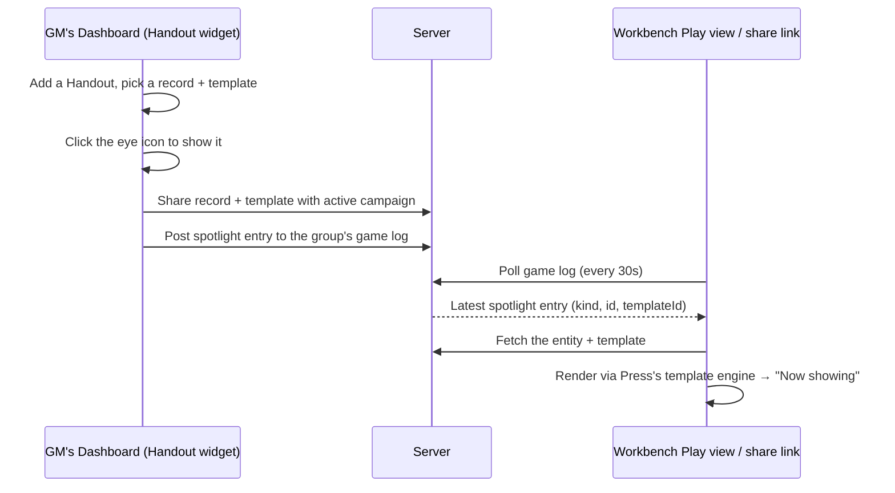

# Undercroft Suite

Undercroft is a suite of TTRPG tools for building content and running sessions —
system-agnostic by default, D&D 5e-flavored out of the box. Each tool is a
useful generator or editor on its own, but they share one account system, one
content library, and one campaign model, so a GM can prep across several tools
and then run an actual session without leaving the suite.

This document covers the whole suite: what each tool does, how content and
accounts work across all of them, and — the part that ties it together — how a
GM shares prepped content with a table and shows it live during play.

---

## The tools

| Tool | Role |
| --- | --- |
| **Workbench** | Character sheets, plus the live Play view a table actually uses during a session (game log, dice rolls, "Now showing" cards). |
| **Loom** | The generic Library/System editor — every reference-data kind (Systems, Species, Archetypes, Features, Resources, and any creator-defined kind) is authored here. |
| **Sanctum** | Location/Setting generator — settlements, structures, regions, and everything about them (features, assets, needs, relationships). |
| **Forge** | NPC generator — identity, 4D personality axes, optional AI-written character notes. |
| **Crucible** | Monster/adversary generator — Creature Type + Archetype + Role, built from a shared feature graph. |
| **Vault** | Spell/magic item generator — a budget-based effect economy built from the same feature graph as Crucible. |
| **Orrery** | System-agnostic map builder — base maps, layers, grids, groups, and entity-referencing markers. |
| **Press** | Print/export utility — turns any saved record into a card, sheet, or booklet via authored templates. |
| **Admin** | Account tiers, content ownership, sharing, and Campaign Groups management. |

Every tool shares the same header chrome (login, tool switcher, theme toggle,
and — once signed in — the Campaign selector described below), the same
three-pane shell, and the same save/share/print plumbing described next.

---

## Shared architecture

### The Library

Nearly everything any tool produces — a System, a Location, an NPC, a Monster,
an Effect, a Template, a Map — is a **Library item**: one row in a single
database table (`library_items`), addressed by a `kind` (`location`, `npc`,
`monster`, `map`, …) and an `id`. A new kind needs no new server code — dropping
a `undercroft/common/data/kind/<kind>.json` file in (label, icon, and the two
tiers below) is enough for every generic save/list/get/delete/share route to
support it immediately.

### Accounts and tiers

Every account has one tier: **free < player < gm < creator < admin**. Each
Library kind declares a `readTier` (how high a tier you need to *see* it) and a
`writeTier` (how high a tier you need to *save* it) — a fresh, unregistered kind
defaults to "anyone can read, only an admin can write." Most generator output
(NPCs, Monsters, Effects) is wide open; authoring-heavy kinds (Locations,
Settings, Systems) require `creator` tier or higher.

### Local-first saving

None of the generator tools (Forge, Crucible, Vault, Sanctum, Orrery) require
signing in. An anonymous visitor's saves go to their own browser's local
storage; a signed-in user's saves go to the server as a real, ownable,
shareable record. Signing in later doesn't strand anonymous work — every
tool's save path is "local, unless authenticated," never "local only for
guests."

### Sharing

Every Library kind supports the same sharing model, managed from each tool's
own inspector or from Admin: a record can be made **public** (anyone can read
it), or shared with a specific **user** or a **Campaign Group** (below), each
grant carrying `view` or `edit` permission. A share targeting a group applies
to every current member transparently — sharing once with a group is
equivalent to sharing individually with everyone in it, and stays current as
membership changes.

---

## Campaign Groups

A **Campaign Group** (managed in Admin) is how a GM organizes a table: an
owner, a name, and a roster of member characters. Groups are useful for two
things:

1. **A share target.** Any Library record can be shared with a group in one
   step, instantly visible to every member, instead of sharing with each
   player one at a time.
2. **A live session channel.** Each group has a running **game log** — dice
   rolls, messages, and (see below) spotlighted cards — visible to every
   member and, via a public share link, to anyone at the table without an
   account at all. Workbench's Play view polls this log every 30 seconds, so
   it works as a lightweight "what's happening right now" feed with zero setup.

### The active campaign

Once a GM has at least one group, every tool's header grows a **Campaign**
selector (next to the login control) listing that GM's own groups. Picking one
sets the *active campaign* — a single, shared selection (via `localStorage`,
scoped to the browser, not the tool) that every other tool immediately sees
too. Switch to Sanctum mid-session and the same campaign is already selected;
no re-picking it per tool.

The active campaign exists to make sharing frictionless: once one is picked,
sharing dialogs across the suite offer a one-click **"Share with \[active
campaign\]"** button alongside the full user/group picker — the common case
(share this with the table I'm currently running) takes one click instead of
finding the right group in a list every time.

---

## Showing content live: Handout widgets

This is the feature that actually makes a live session work: a GM can put a
generated card up in front of the table, live, without exporting anything or
switching to Press themselves. The Dashboard is the single place this is
controlled from — there's no separate "show to table" action buried in
Sanctum/Forge/Crucible/Vault; what's visible to players is exactly what the
GM's own Dashboard shows as toggled on.

**On the GM's side** — add a **Handout** widget from the Dashboard's
Edit-layout toolbar: pick the record (an NPC, Location, Monster, or Effect)
and, optionally, one of your saved Press templates (no template just shows a
plain name/description card). Click the eye icon on the widget's header to
show it to the active campaign, and again to stop — the icon always reflects
whether *this* Handout is the one currently visible, even after a reload.
Maps work the same way via a Map widget, or from Orrery's own signed-in menu.

**On the table's side** — Workbench's Play view (the same page a group's
public share link opens) polls the group's game log and shows a **Now
showing** panel alongside it, rendering the latest spotlighted card through
Press's own template-rendering engine — the exact same function the Handout
widget itself renders through, not a re-implementation. Showing a different
Handout replaces it instantly for everyone watching.

A private record that's only ever been spotlighted (never explicitly shared)
still shows correctly to an anonymous visitor on the group's public share
link — spotlighting automatically grants exactly enough read access for the
currently-shown entity and template, nothing more, nothing retroactive.

---

## Maps in a campaign

Orrery maps are Library items like everything else (own/share/publish them
the same way), with two features specific to running a game:

- **Entity-referencing markers.** A marker layer holds real pins, each
  optionally pointing at any other Library entity (a Location, an NPC, a
  Monster, …) via `{ refKind, refId, label }`. Clicking a pin surfaces what
  it's linked to; dropping and dragging pins is direct click-and-drag on the
  map itself once a marker layer is selected.
- **Tiered Views.** A map can define named Views, each gating a subset of
  layers to a set of viewer tiers (e.g. a "Player" view that hides a GM-only
  secrets layer). The map's owner/editor always sees everything, unfiltered —
  Views only ever apply to someone else viewing a shared or public map.

---

## Running a session, end to end

A typical arc, using everything above together:

1. **Prep.** Build out a Setting and its Locations in Sanctum, generate NPCs
   in Forge and monsters in Crucible, roll up a few items in Vault, and lay
   out a regional map in Orrery with markers pointing at the Locations you
   just made. Design a couple of Press templates (an NPC card, a shop-goods
   card) if you don't have them already.
2. **Open the table.** Create a Campaign Group in Admin (or reuse one from a
   past session) and pick it as your active campaign — it's now selected in
   every tool's header.
3. **Share what the table needs.** From each tool's inspector, share the
   session-relevant records — one click each, since "Share with \[active
   campaign\]" is already pointed at tonight's game.
4. **Go live.** Send your players the group's share link (or have them sign
   in and open Workbench directly). Their Play view shows the game log and
   the Now-showing panel; character rolls post to the same log automatically.
5. **Run it.** Show an NPC's card when they walk into a shop. Switch to
   Orrery, drop a pin on the map for a location they just discovered. Spotlight
   a monster's stat card the moment initiative rolls. Every one of these is a
   couple of clicks from whichever tool you're already in — nobody has to
   leave the table's view to see what you show them.

---

## For developers

- `server/` — the shared Python backend (auth, the generic Library
  save/list/get/delete/share routes, Campaign Groups, kind-registry tier
  policy). No per-kind server code is needed for a new Library kind.
- `undercroft/common/` — shared JS (`js/lib/`, notably `data-manager.js` for
  all client/server data access and `auth-ui.js` for the shared header chrome)
  and shared data (`data/kind/*.json`, the kind registry; `data/help-topics.json`).
- Each tool directory is self-contained (`index.html`, `js/`, `css/`) and many
  carry their own `README.md`/`ROADMAP.md`/`CLAUDE.md` with tool-specific
  design detail — read the relevant one before making changes there.
- `AGENTS.md` (this directory) has the suite-wide coding conventions (vanilla
  JS, Bootstrap-first, shared three-pane shell).
